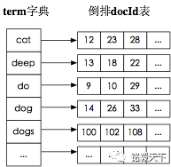
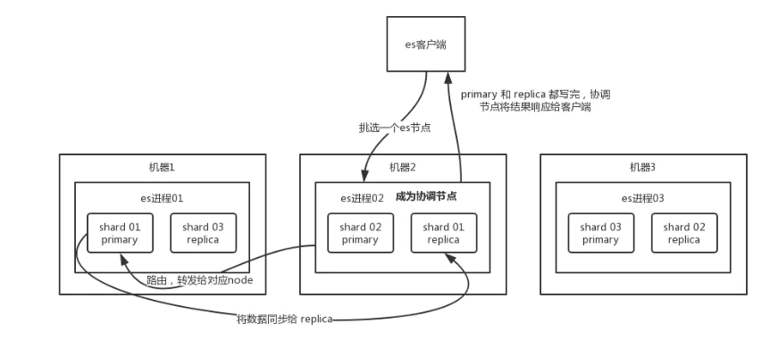
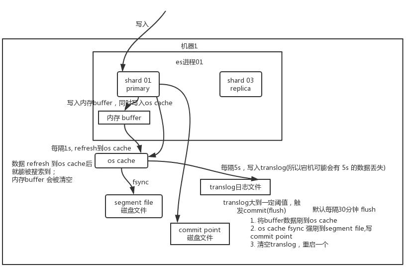

# Es
#### Q0 什么是Elasticsearch？
Elasticsearch是一个基于Lucene的搜索引擎.它提供了具有HTTP Web界面和无架构JSON文档的分布式,
多租户能力的全文搜索引擎.

Elasticsearch是用java开发的,根据Apache许可条款作为开源发布.
#### Q1 为什么要使用Elasticsearch？
因为在我们商城中的数据，将来会非常多，所以采用以往的模糊查询，模糊查询前缀匹配，索引失效，会放弃索引，导致商品查询是全表扫面，在百万级别的数据库中，效率非常低下，而我们使用ES做一个全文索引，我们将经常查询的商品的某些字段，比如说商品名，描述、价格还有id这些字段我们放入我们索引库里，可以提高查询速度。
#### Q2 什么是倒排索引(词典+映射表)？

传统的索引方式是通过文章,逐个遍历找到对应关键词的位置.
倒排索引,是通过分词策略,形成了词和文章的映射关系表,也称倒排表,这种词典+映射表即为倒排索引.
其中词典中存储词元,倒排表中存储该词元在哪些文中出现的位置.
有了倒排索引，就能实现 O(1) 时间复杂度的效率检索文章了，极大的提高了检索效率。
倒排索引的底层实现是基于：FST（Finite State Transducer有限状态转换器）数据结构。
Lucene 从 4+ 版本后开始大量使用的数据结构是 FST。FST 有两个优点：
1）空间占用小。通过对词典中单词前缀和后缀的重复利用，压缩了存储空间；
2）查询速度快。O(len(str)) 的查询时间复杂度。
#### Q3 ES是如何实现master选举的?
前置条件：
1）只有是候选主节点（master：true）的节点才能成为主节点。
2）最小主节点数（min_master_nodes）的目的是防止脑裂。
Elasticsearch 的选主是 ZenDiscovery 模块负责的，主要包含 Ping（节点之间通过这个RPC来发现彼此）和 Unicast（单播模块包含一个主机列表以控制哪些节点需要 ping 通）这两部分；
获取主节点的核心入口为 findMaster，选择主节点成功返回对应 Master，否则返回 null。
选举流程大致描述如下：
第一步：确认候选主节点数达标，elasticsearch.yml 设置的值 discovery.zen.minimum_master_nodes;
第二步：对所有候选主节点根据nodeId字典排序，每次选举每个节点都把自己所知道节点排一次序，然后选出第一个（第0位）节点，暂且认为它是master节点。
第三步：如果对某个节点的投票数达到一定的值（候选主节点数n/2+1）并且该节点自己也选举自己，那这个节点就是master。否则重新选举一直到满足上述条件。
master节点的职责主要包括集群、节点和索引的管理，不负责文档级别的管理；data节点可以关闭http功能。
#### Q4 如何解决ES集群的脑裂问题
可以通过设置最少投票通过数量（discovery.zen.minimum_master_nodes）超过所有候选节点一半以上，来解决脑裂问题
当候选数量为两个时，只能修改为唯一的一个 master 候选，其他作为 data 节点，避免脑裂问题。
#### Q5 详细描述一下ES写入的流程
https://www.jianshu.com/p/6605934aba6b

1. es写数据过程
    1. 客户端选择node发送请求,这个node就是coordinating node（协调节点）
    1. coordinating node 对 document 进行路由，将请求转发给对应的 node（有 primary shard）。
    1. 实际的 node 上的 primary shard 处理请求，然后将数据同步到 replica node。
    1. coordinating node 如果发现 primary node 和所有 replica node 都搞定之后，就返回响应结果给客户端。
       
2. es写数据底层原理
   开始写入->index_buffer(无法被搜索到),translog->filesystem cache(merge segment file,此时可以被搜索到->disk
1. 写入的数据先写入一个index_buffer的内存空间中，在index buffer中的数据**无法被搜索到**，这是ES无法保证100%实时的原因， indices.memory.index_buffer_size配置该空间的大小。
2. 在写入index_buffer同时记录translog，translog用于记录每次写入的数据，在持久化失败后，可用于数据恢复。
3. index_buffer的空间被占满或者达刷新间隔到了index.refresh_interval的值时，会刷新的操作系统的filesystem cache中,此时清空buffer。
4. filesystem cache中数据，也会在一定的时间间隔，flush到磁盘中，当刷新到磁盘后，就会删除对应的文档的translog中数据。
5. buffer每次更新一次，就会产生一个segment file 文件，所以在默认情况之下，就会产生很多的segment file 文件，将会定期执行merge操作
6. 每次merge的时候，就会将多个segment file 文件进行合并为一个，同时将标记为delete的文件进行删除，然后将新的segment file 文件写入到磁盘，这里会写一个commit point，标识所有的新的segment file，然后打开新的segment file供搜索使用。
#### Q6 详细描述一下ES更新和删除文档的过程？
删除和更新都是写操作，但是ElasticSearch中的文档是不可变的，因此不能被删除或者改动以展示其变更。
磁盘上的每个段都有一个相应的.del文件。当删除请求发送后，文档并没有真的被删除，而是在.del文件中被标记为删除。该文档依然能匹配查询，但是会在结果中被过滤掉。当段合并时，在.del文件中被标记为删除的文档将不会被写入新段。
在新的文档被创建时，ElasticSearch会为该文档指定一个版本号，当执行更新时，旧版本的文档在.del文件中被标记为删除，新版本的文档被索引到一个新段。旧版本的文档依然能匹配查询，但是会在结果中会被过滤掉。
- del:如果是删除操作,在commit的时候会生成一个.del文件,被标识为deleted状态的doc就不会被搜索到
- update:先讲原来的doc标识为deleted状态,然后新写入一条数据.
#### Q7 详细描述一下ES读数据与搜索的过程？
读数据流程:
客户端->协同节点->hash(doc id)->node->协同节点->客户端
1. 客户端发送请求到任意一个node,成为coordinate node
2. coordinate node根据doc id进行hash,进而路由找到对应的shard上.
3. 接收请求的node返回document给coordinate node
4. coordinate node 返回 document 给客户端
   ES的搜索过程:搜索被执行成一个两阶段过程，即 Query Then Fetch；
1. Query阶段：查询会广播到索引中每一个分片拷贝（主分片或者副本分片）。每个分片在本地执行搜索并构建一个匹配文档的大小为 from + size 的优先队列。PS：在搜索的时候是会查询Filesystem Cache的，但是有部分数据还在Memory Buffer，所以搜索是近实时的。
   每个分片返回各自优先队列中 所有文档的 ID 和排序值 给协调节点，它合并这些值到自己的优先队列中来产生一个全局排序后的结果列表。
1. Fetch阶段：协调节点辨别出哪些文档需要被取回并向相关的分片提交多个 GET 请求。每个分片加载并 丰富 文档，如果有需要的话，接着返回文档给协调节点。一旦所有的文档都被取回了，协调节点返回结果给客户端。
#### Q8 在并发情况下，ES如果保证读写一致？
表象:
1. 通过版本号使用乐观锁并发控制,以确保新版本不会被旧版本覆盖,**由应用层来处理具体的冲突**;
1. 对于写操作,一致性级别支持quorum/one/all,默认为quorum,即只有当大多数分片可用时才允许写操作.但即使大多数可用，也可能存在因为网络等原因导致写入副本失败，这样该副本被认为故障，分片将会在一个不同的节点
1. 对于读操作,可以设置 replication 为 sync(默认)，这使得操作在主分片和副本分片都完成后才会返回；如果设置 replication 为 async 时，也可以通过设置搜索请求参数_preference 为 primary 来查询主分片，确保文档是最新版本。
   底层:要达到数据一致性,需要满足:
- 持久性:数据写入成功后,数据持久化存在,不会发送回滚或丢失的情况
    - 通过replica和translg两种机制保证
- 一致性:数据写入成功后,查询时要保证读取到最新版本的数据,不能读取到旧数据
    - 数据写入成功后，需完成refresh操作之后才可读，由于无法保证Primary和Replica可同时refresh，所以会出现查询不稳定的情况，这里只能实现**最终一致性**。
- 原子性:一个写入或者操作,要么成功,要么失败,不允许出现中间状态.
    - Add和Delete直接调用Lucene的接口，进行原子操作。update操作通过Delete-Then-Add完成，在Delete操作之前会加Refresh Lock，禁止Refresh操作，等Add操作完成后释放Refresh Lock后才能被Refresh，这样就保证了Delete-Then-Add的原子性。
- 隔离性:多个写入并发操作而互不影响.
    - 采用Version和局部锁来保证更新的是特定版本的数据。
    - 设置wait_for_active_shards参数大于等于2。
    - 设置TransLog的Flush策略为每个请求都要Flush。
#### Q9 数据量很大的情况下（数十亿级别）如何提高查询效率
1. 增加内存:es性能优化的杀手锏：filesystem cache(OS cache)：也就是说 尽量让内存可以容纳所有的索引数据文件，那么搜索的时候就基本都是走内存的，性能会非常高。
1. 数据预热:对热数据每隔一段时间，就提前访问一下，让热数据进入 filesystem cache 里面去。
1. document 模型设计:尽量存放单纯的数据(大宽表),尽量避免join/nested/parent-child
1. 分页性能优化:使用`scroll api`实现分页操作,scroll 会一次性给你生成所有数据的一个快照，然后每次滑动向后翻页就是通过游标 scroll_id 移动，获取下一页下一页这样子，性能会比上面说的那种分页性能要高很多很多，基本上都是毫秒级的。初始化时必须指定 scroll 参数，告诉 es 要保存此次搜索的上下文多长时间。你需要确保用户不会持续不断翻页翻几个小时，否则可能因为超时而失败。
#### Q10 Es节点类型
- master node
  职责：
  处理创建，删除索引等请求 / 决定分片⽚被分配到哪个节点 / 负责索引的创建与删除；
  维护并且更新 Cluster State，且只能由 master node 维护，否则会造成集群状态不正常。
  最佳实践：
  master node非常重要，部署时需要解决单点问题；
  一个集群中设置多个master node，每个node只承担master的单一角色；
- data node
  职责：

保存分片数据。在数据扩展上起到了至关重要的作用（由 Master Node 决定如何把分片分发到数据节点上）；
最佳实践：

节点启动后，默认就是数据节点。可以设置 node.data: false 禁止；
通过增加数据节点，可以解决数据水平扩展和解决数据单点问题；

- coordinating Node
  处理请求的节点，负责路由请求到正确的节点，如创建索引的请求需要路由到 Master 节点；
  所有节点默认都是 Coordinating Node；
  通过将其他类型（data node/master node/master eligible node）设置成 False，使其成为专门负责的协调的节点；
#### Q11 Es集群搭建
#### Q12 Es索引使用

#### Q12 Es聚合