# Redis
Redis默认16个database
##### Q0:redis单线程为什么快
1. 纯内存操作
1. 单线程,避免的线程之间上下文切换造成的性能问题
(只是在处理我们的网络请求的时候只有一个线程来处理;
从Redis 4.0版本开始会支持多线程,仅支持部分操作)
1. 使用多路I/O复用模型，非阻塞IO
多路 I/O 复用模型:多路I/O复用模型是利用 select、poll、epoll 可以同时监察多个流的 I/O 事件的能力，
在空闲的时候，会把当前线程阻塞掉，当有一个或多个流有 I/O 事件时，就从阻塞态中唤醒，于是程序就会轮询一遍所有的流（epoll 是只轮询那些真正发出了事件的流），并且只依次顺序的处理就绪的流，这种做法就避免了大量的无用操作。
这里“多路”指的是多个网络连接，“复用”指的是复用同一个线程。
采用多路 I/O 复用技术可以让单个线程高效的处理多个连接请求（尽量减少网络 IO 的时间消耗。
##### Q1:redis的过期策略
- 惰性过期(被动删除)：当读/写一个已经过期的key时，会触发惰性删除策略，直接删除掉这个过期key
- 定期过期(主动删除)：由于惰性删除策略无法保证冷数据被及时删掉，所以Redis会定期主动淘汰一批已过期的key
平衡执行频率和执行时长
定期过期会扫描所有的database(默认16个),检查当前库中指定个数的key(默认20个),随机抽查,如果有过期的就删除,系统中有全局变量记录扫描到的库
- 当前已用内存超过maxmemory限定时，触发主动清理策略
##### Q2 Redis的持久化机制
- RDB(redis database):数据快照,生成.rdb的二进制文件
1. 触发机制:
    1)save:导致线程阻塞
    2)gbsave:fork一个子进程进行持久化,主进程在fork过程中短暂阻塞.子进程持久化完成后,主进程恢复.
    Q:如何保证主进程恢复之后,子进程备份数据不会错乱?
    A:copyOnWrite策略;主进程拷贝共享内存数据,在副本中进行修改,修改完之后再覆盖回去
    3)自动触发:save m n 在m秒内 n个key发生变化 通过bgsave进行持久化
    flushall:生成.rdb文件,内容为空
    主从同步:全量同步自动触发bgsave,生成.rdb发送给从节点
2. 优点:
    1)整个redis生成一个.rdb文件,方便持久化
    2)容灾性好,方便备份
    3)性能最大化;fork出子进程之后,主进程继续处理命令;由子进程处理IO;保证高性能
    4)相对于数据集大时,比AOF效率更高
3. 缺点:
    1)数据安全性低,数据丢失
    2)频繁rdb,会频繁阻塞服务;
- AOF(Append-only file):以文件的形式记录服务器处理的每一个写、删除操作,查询操作不会;
可以打开文件看到详细的操作记录,调操作系统命令进行刷盘
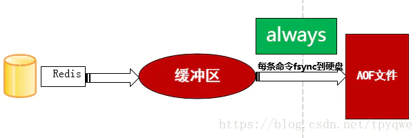
1. 三种同步策略
    ①always:只要缓冲区有数据 立马写入文件中;不会丢失数据,但是磁盘开销较大
    ②everysec:每隔一秒将数据从缓冲区写入文件中;只会丢失1秒的数据
    ③no:写文件的操作交由操作系统控制
2. AOF rewrite:
    引入原因:随着数据的不断写入,会造成AOF文件不断增大,重复的命令会额外占用磁盘空间,而是增加redis重启速度
    AOF重写作用：1.减少磁盘占用量2.加速启动速度
    AOF文件重写不是对原有AOF文件进行读取分析,而是读取最新的数据进行分析实现的。
    AOF重写触发机制:1.bgrewriteaof 2.AOF重写配置（同时满足配置文件中auto-aof-rewrite-percentage auto-aof-rewrite-min-size两个配置）
    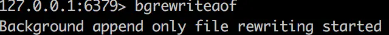
3. 优点:
    1)数据安全
    2)即使服务器宕机也不会影响之前的已经存在的内容,可以通过redis-check-aof工具解决数据的一致性问题
    3)重写机制;能达到压缩的目的
4. 缺点:
    1)AOF文件比RDB文件大,恢复速度慢
    2)数据集较大时,启动比RDB慢
    3)运行效率没有RDB高
- redis存在AOF与RDB两种持久化方式,如果redis宕机或重启时想要恢复数据,会优先采用哪种方式恢复数据呢？
AOF与RDB同时开启时,会优先使用AOF恢复数据,如果采用RDB恢复数据,可以先将AOF关闭,appendonly no,重启完成后，执行config set appendonly yes动态开启AOF
##### Q3 Redis的集群方案
- 主从复制模式
1. 工作机制:
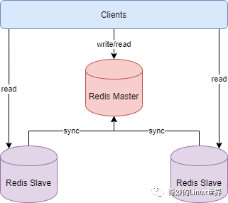
    1)slave启动后，向master发送SYNC命令，master接收到SYNC命令后通过bgsave保存快照，并使用缓冲区记录保存快照这段时间内执行的写命令
    2)master将保存的快照文件发送给slave，并继续记录执行的写命令
    3)slave接收到快照文件后，加载快照文件，载入数据
    4)master快照发送完后开始向slave发送缓冲区的写命令，slave接收命令并执行，完成复制初始化
 此后master每次执行一个写命令都会同步发送给slave，保持master与slave之间数据的一致性
1. 优点:
    1)master能自动将数据同步到slave，可以进行读写分离，分担master的读压力
    1)master、slave之间的同步是以非阻塞的方式进行的，同步期间，客户端仍然可以提交查询或更新请求
1. 缺点:
    1)不具备自动容错与恢复功能，master或slave的宕机都可能导致客户端请求失败，需要等待机器重启或手动切换客户端IP才能恢复
    2)master宕机，如果宕机前数据没有同步完，则切换IP后会存在数据不一致的问题
    3)难以支持在线扩容，Redis的容量受限于单机配置
- Sentinel（哨兵）模式
1. 工作机制:
哨兵模式基于主从复制模式，只是引入了哨兵来监控与自动处理故障
集群监控:监控master、slave是否正常运行
消息通知:某个实例发生故障,通知管理员
故障转移:当master出现故障时，能自动将一个slave转换为master
配置中心:如果master发生故障,通知client客户端新的地址
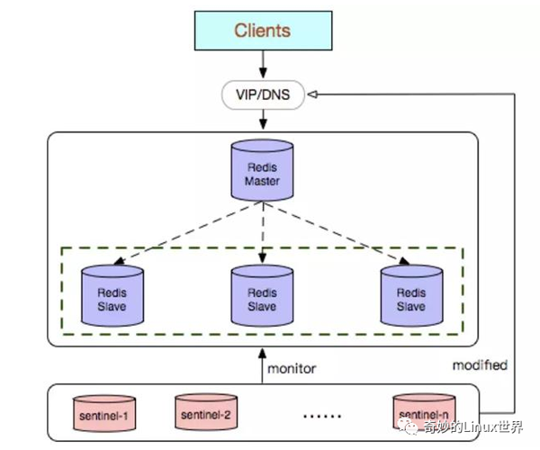
1. 优点:
    1)哨兵模式基于主从复制模式，所以主从复制模式有的优点，哨兵模式也有
    2)哨兵模式下，master挂掉可以自动进行切换，系统可用性更高
1. 缺点:
    1)同样也继承了主从模式难以在线扩容的缺点，Redis的容量受限于单机配置
    2)需要额外的资源来启动sentinel进程，实现相对复杂一点，同时slave节点作为备份节点不提供服务
- Cluster模式
1. 工作机制
    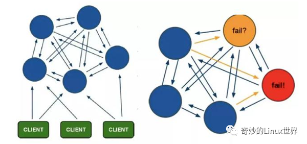
    1)在Redis的每个节点上，都有一个插槽（slot），取值范围为0-16383
    2)当我们存取key的时候，Redis会根据CRC16的算法得出一个结果，然后把结果对16384求余数，这样每个key都会对应一个编号在0-16383之间的哈希槽，通过这个值，去找到对应的插槽所对应的节点，然后直接自动跳转到这个对应的节点上进行存取操作
    3)为了保证高可用，Cluster模式也引入主从复制模式，一个主节点对应一个或者多个从节点，当主节点宕机的时候，就会启用从节点
    4)当其它主节点ping一个主节点A时，如果半数以上的主节点与A通信超时，那么认为主节点A宕机了。如果主节点A和它的从节点都宕机了，那么该集群就无法再提供服务了
1. 优点
    1)无中心架构，数据按照slot分布在多个节点。
    2)集群中的每个节点都是平等的关系，每个节点都保存各自的数据和整个集群的状态。每个节点都和其他所有节点连接，而且这些连接保持活跃，这样就保证了我们只需要连接集群中的任意一个节点，就可以获取到其他节点的数据。
    3)可线性扩展到1000多个节点，节点可动态添加或删除
    4)能够实现自动故障转移，节点之间通过gossip协议交换状态信息，用投票机制完成slave到master的角色转换
1. 缺点
    1)客户端实现复杂，驱动要求实现Smart Client，缓存slots mapping信息并及时更新，提高了开发难度。目前仅JedisCluster相对成熟，异常处理还不完善，比如常见的“max redirect exception”
    2)节点会因为某些原因发生阻塞（阻塞时间大于 cluster-node-timeout）被判断下线，这种failover是没有必要的
    3)数据通过异步复制，不保证数据的强一致性(可以设置)
    4)slave充当“冷备”，不能缓解读压力
    5)批量操作限制，目前只支持具有相同slot值的key执行批量操作，对mset、mget、sunion等操作支持不友好
    6)key事务操作支持有线，只支持多key在同一节点的事务操作，多key分布不同节点时无法使用事务功能
    7)不支持多数据库空间，单机redis可以支持16个db，集群模式下只能使用一个，即db 0
##### Q4 Redis的数据结构以及使用场景
Redis 数据类型分为：字符串类型、散列类型、列表类型、集合类型、有序集合类型。
- 字符串(String):分布式锁、分布式ID、计数器
- 哈希表(hash):存放对象
- 列表(List):可以当作栈以及队列
- 集合(Set):与列表类似,但是不能重复,用于存储共同好友、朋友圈点赞
- 有序集合(Sorted set):有顺序的集合;可以用于排行榜功能等
- bitmap:布隆过滤器
- GeoHash:存储坐标;借助Sorted set实现;通过Zset的score进行排序就可以得到坐标附近的其他元素;通过score还原成坐标值就可以得到元素的原始坐标
- HyperLogLog:统计不重复的数据
- Streams:内存kakfa
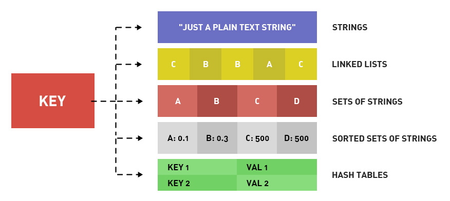
##### Q5 Redis的主从同步复制原理
通过执行slaveof命令或者配置slaveof选项,进行主从复制
- 全量复制
1. 主节点通过bgsave命令,fork出子进程进行RDB持久化;消耗cpu\内存\硬盘IO很大
1. 主节点通过网络将RDB文件发送至从节点;主从节点带宽消耗大
1. 从节点删除老数据,载入RDB;此时无法响应客户端命令,如果此时执行bgrewriteaof也会带来消耗
- 增量复制
1. 复制偏移量:执行复制的双方,各自维护一个复制偏移量offset
1. 复制积压缓存区:主节点内部维护一个固定长度、先进先出(FIFO)队列作为复制积压缓存区;当主从节点的偏移量差异大于缓冲区长度时,无法复制,只能全量复制.
1. 服务器运行ID(runid)::服务器运行ID是每一台服务器每次运行的身份识别码,一台服务器多次运行可以生成多个运行id
主节点会将自己的runid发送到从节点,从节点接收后进行保存;当从节点断开重新连接时;就通过runid判断更新进度
    1)如果主从节点runid一致,表示主从节点之前同步过;会继续尝试部分更新
    2)如果主从节点runid不一致;说明从节点在断线前同步的节点并不是当前主节点;只能采用全量更新
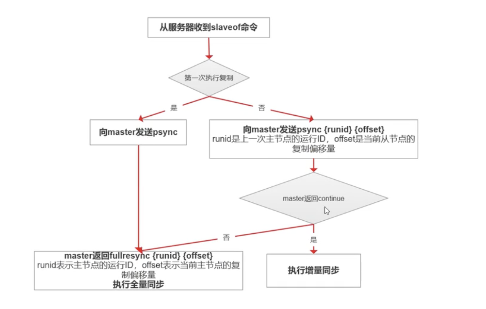
##### Q6 布隆过滤器的原理以及优缺点(用于判断一个元素是否在一个集合中)
1. hash函数的特点
- 如果根据同一个哈希函数得到的哈希值不同，那么这两个哈希值的原始输入值肯定不同。
- 如果根据同一个哈希函数得到的两个哈希值相等，两个哈希值的原始输入值有可能相等，有可能不相等。
2. 布隆过滤器原理
布隆过滤器是一个 bit 向量或者说 bit 数组
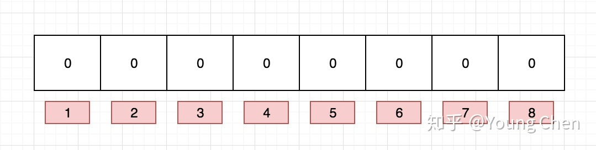
当有变量添加到布隆过滤器中，通过K个映射函数将变量映射到位数组的K个点，并把这K个点的值设置为1(假设有三个映射函数)。
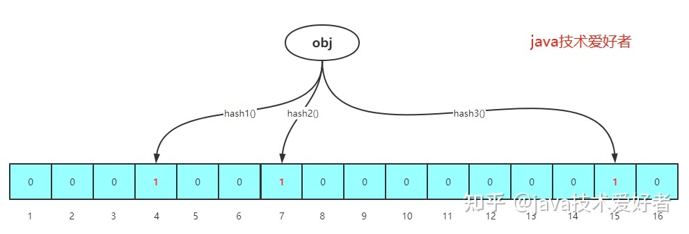
查询某个变量是否存在的时候，我们只需要通过同样的K个映射函数，找到对应的K个点，判断K个点上的值是否全都是1，如果全都是1则表示很可能存在，如果K个点上有任何一个是0则表示一定不存在。
3. 优点
- 在空间和时间方面，都有着巨大的优势。因为不是存完整的数据，是一个二进制向量，能节省大量的内存空间，时间复杂度方面，是根据映射函数查询，假设有K个映射函数，那么时间复杂度就是O(K)。
- 因为存的不是元素本身，而是二进制向量，所以在一些对保密性要求严格的场景有一定优势。
4. 缺点
- 存在一定的误判。存进布隆过滤器里的元素越多，误判率越高。
- 不能删除布隆过滤器里的元素。随着使用的时间越来越长，因为不能删除，存进里面的元素越来越多，占用内存越来越多，误判率越来越高，最后不得不重置。
##### Q7 常见的缓存淘汰算法
- FIFO：First In First Out，先进先出。判断被存储的时间，离目前最远的数据优先被淘汰。
- LRU：Least Recently Used，最近最少使用。判断最近被使用的时间，目前最远的数据优先被淘汰。
- LFU：Least Frequently Used，最不经常使用。在一段时间内，数据被使用次数最少的，优先被淘汰。
##### Q8:缓存雪崩、穿透、击穿
- 缓存穿透:redis查不到;DB也查不到
解决方案:
1. 对参数进行合法性校验;
2. 对无效的key进行缓存;(key:null);但是需要注意其过期时间;防止将redis占满
3. 引用布隆过滤器
- 缓存击穿:redis查不到;DB能查到
解决方案:
1. 热点缓存永不过期
2. 另起线程来同步DB数据到缓存中;可能存在数据不一致的问题
3. 互斥锁
- 缓存雪崩:缓存大面积过期;导致请求大量被转发到DB
解决方案:
1. 把缓存的失效时间分散开;例如在原有的过期时间上增加一个随机值
2. 热点数据永不过期
3. 缓存预热
4. 互斥锁
##### Q8:redis中的事物机制
1. 事物的相关命令
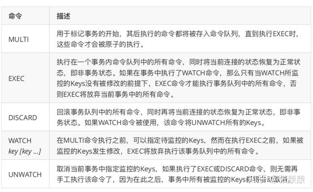
2. Redis事务从开始到结束通常会通过三个阶段:
    1)事务开始
    2)命令入队
    3)事务执行
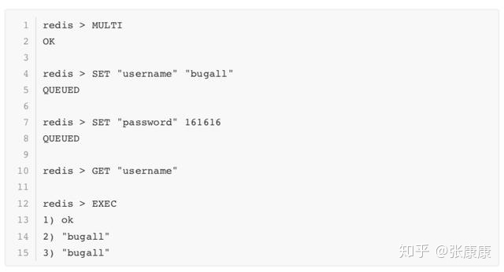
3. 注意:
这里需要注意的是，在客户端打开了事务标识后，只有命令：EXEC，DISCARD，WATCH，MULTI命令会被立即执行，其它命令服务器不会立即执行，而是将这些命令放入到一个事务队列里面，然后向客户端返回一个QUEUED回复;
事务队列以先进先出的保存方法，较先入队的命令会被放到数组的前面，而较后入队的命令则会被放到数组的后面。
**不支持事务回滚(执行时错误会继续执行而不回滚)**是因为这种复杂的功能和Redis追求的简单高效的设计主旨不符合，并且他认为，Redis事务的执行时，错误通常都是编程错误造成的，这种错误通常只会出现在开发环境中，而很少会在实际的生产环境中出现，所以他认为没有必要为Redis开发事务回滚功能。所以我们在讨论Redis事务回滚的时候，一定要区分命令发生错误的时候。
#### Q9:如何保证数据库和Redis的数据一致
https://zhuanlan.zhihu.com/p/91770135
总结:
1)延时双删
2)监听binlog 异步丢消息刷新缓存
均只能保证最终数据一致,存在不一致的时刻
#### Q10:RedLock
1.分布式情况下使用redlock而不使用`SET key_name my_random_value NX PX 30000`原因
    1.在Redis的master节点上拿到了锁；
    2.但是这个加锁的key还没有同步到slave节点；
    3.master故障，发生故障转移，slave节点升级为master节点；
    4.导致锁丢失。
2.redlock的原理
假设有5个完全独立的redis主服务器
1. 获取当前时间戳
2. client尝试按照顺序使用相同的key,value获取所有redis服务的锁，在获取锁的过程中的获取时间比锁过期时间短很多，这是为了不要过长时间等待已经关闭的redis服务。并且试着获取下一个redis实例。
比如：TTL为5s,设置获取锁最多用1s，所以如果一秒内无法获取锁，就放弃获取这个锁，从而尝试获取下个锁
3. client通过获取所有能获取的锁后的时间减去第一步的时间，这个时间差要小于TTL时间并且至少有3个redis实例成功获取锁，才算真正的获取锁成功
4. 如果成功获取锁，则锁的真正有效时间是 TTL减去第三步的时间差 的时间；比如：TTL 是5s,获取所有锁用了2s,则真正锁有效时间为3s(其实应该再减去时钟漂移);
5. 如果客户端由于某些原因获取锁失败，便会开始解锁所有redis实例；因为可能已经获取了小于3个锁，必须释放，否则影响其他client获取锁
实现分布式锁的一个非常重要的点就是set的value要具有唯一性，redisson的value是怎样保证value的唯一性呢？答案是**UUID+threadId**。
#### Q11:codis
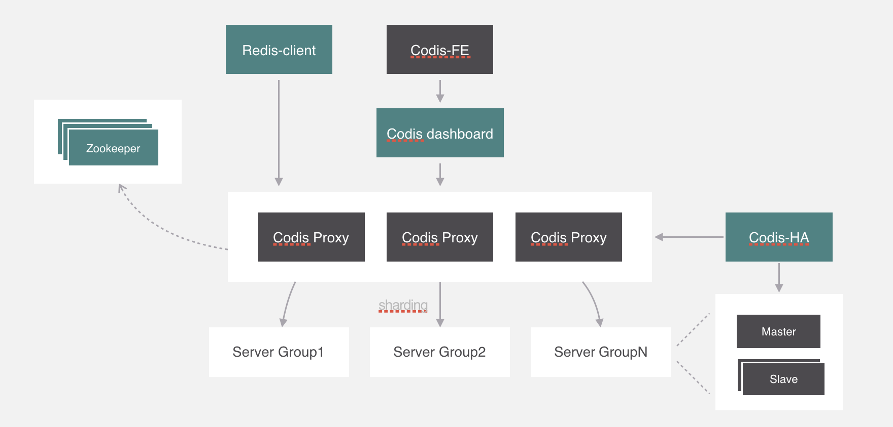
Codis Proxy：它对外提供Redis服务，除了一些不支持的命令外（不支持的命令列表），表现的和原生的Redis没有区别。由于它是无状态的，所以我们可以部署多个节点，从而保证了可用性。
Codis Dashboard：集群管理工具，支持Codis Proxy的添加删除以及数据迁移等操作。对于一个Codis集群，Dashboard最多部署一个
Codis Admin：集群管理的命令行工具
Codis FE：集群管理界面，多个Codis集群可以共用一个Codis FE，通过配置文件管理后端的codis-dashboard
Storage：为集群提供外部存储，目前支持ZooKeeper、Etcd、Fs三种。
Codis Server：基于3.2.8分支开发，增加额外的数据结构，用来支持slot有关的操作及数据迁移指令。
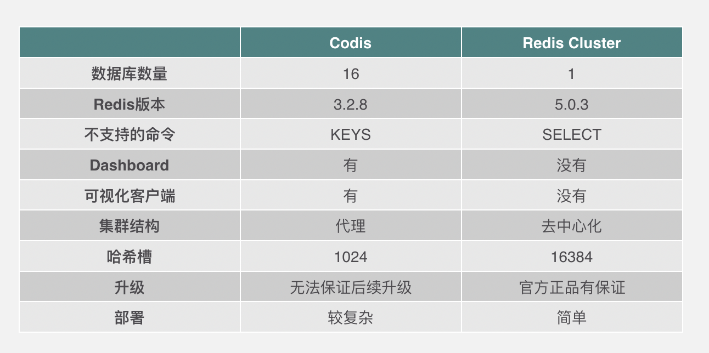
#### Q12:海量数据下;如何进行快速查询?
https://www.cnblogs.com/-wenli/p/13045432.html
#### Q13:redis集群下的算法
- hash solt(redis cluster哈希槽)
`slot = CRC16(key) & 16383`  
- hash算法
根据key的hash值然后取模节点数 ， hash(key)%节点数。
缺点：当节点宕机或者新增，会导致节点数变换，所有数据都要重新计算。  
- 一致性 hash 算法
一致性Hash算法在服务节点太少时，容易因为节点分部不均匀而造成数据倾斜（被缓存的对象大部分集中缓存在某一台服务器上）
  
虚拟节点

就是对真实的机器映射出多个虚拟节点，那么在hash环上就仿佛有很多个机器节点。具体做法可以在服务器IP或主机名的后面增加编号来实现
#### Q14:redis集群方案对比
https://www.jianshu.com/p/1ecbd1a88924
- redis cluster
- codis
#### Q15:redis cluster为什么至少需要三个节点
节点的有效性是靠会投票，50% 的节点认为失效，就算失效。

一个节点，不能给自己投票。

两个节点 A 说 B 下线，B 认为 A 下线，两个人互相说我连接不上你，没有定论。

至少三个节点，A、B 发现 C 不通，互相通知，得到一致性状态：C 的确下线。
#### Q16:redis 大对象的存放方案
大key的危害： 
Redis使用过程中经常会有各种大key的情况， 比如单个简单的key存储的value很大。 
由于redis是单线程运行的，如果一次操作的value很大会对整个redis的响应时间造成负面影响，导致IO网络拥塞。

解决办法：
整存整取的大对象，分拆为多个小对象。可以尝试将对象分拆成几个key-value， 使用multiGet获取值，这样分拆的意义在于分拆单次操作的压力，将操作压力平摊到多个redis实例中，降低对单个redis的IO影响；