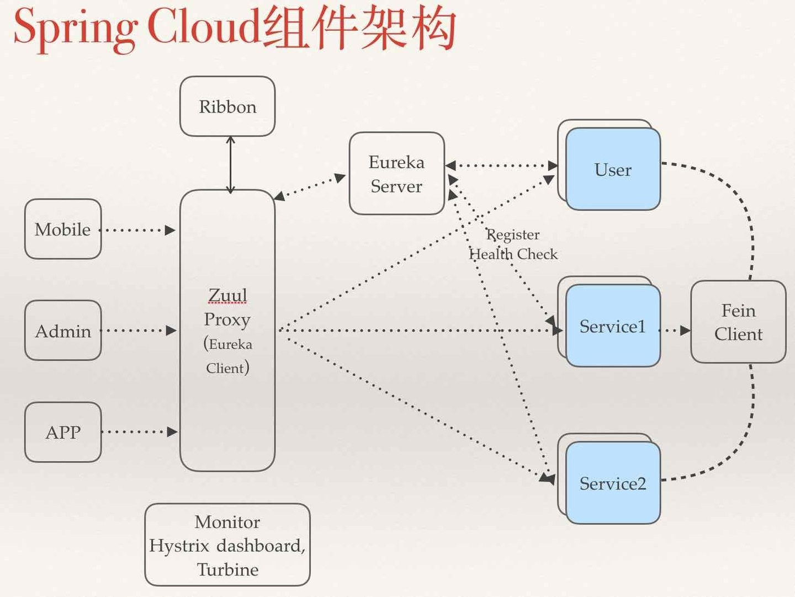
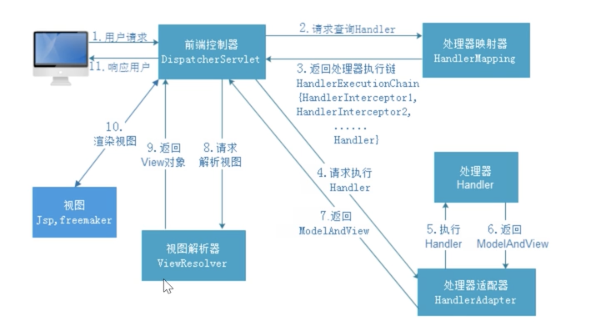
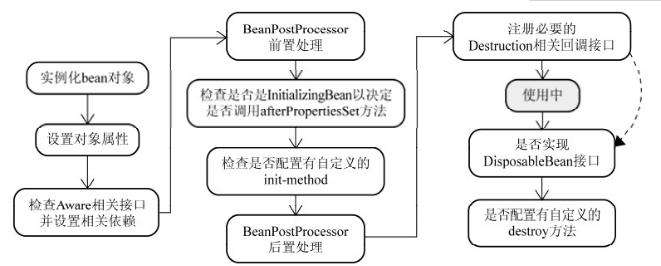
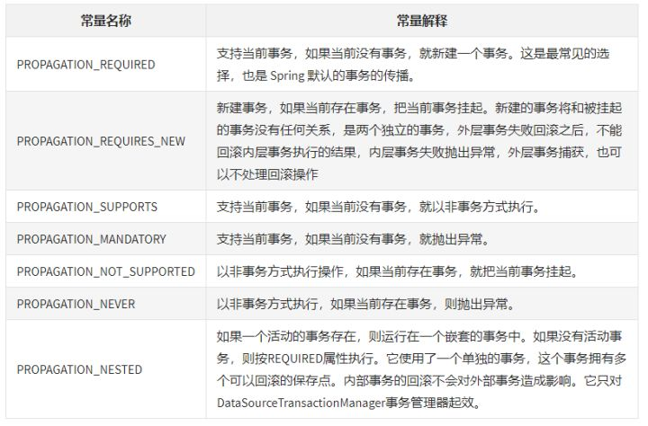
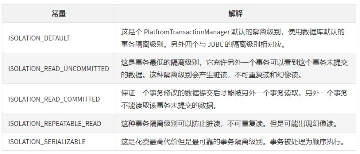
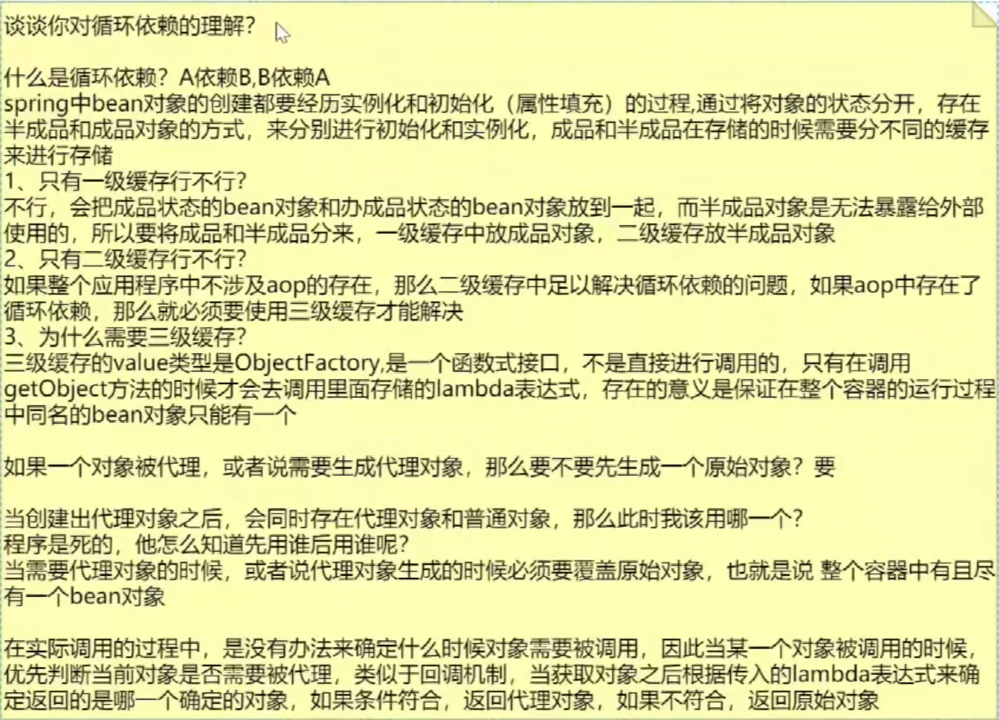
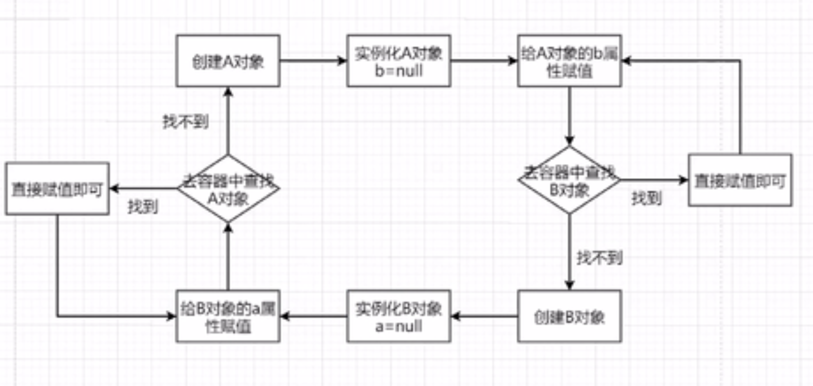
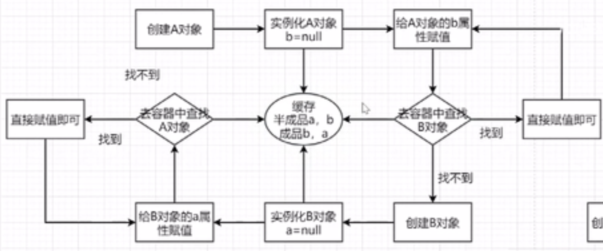
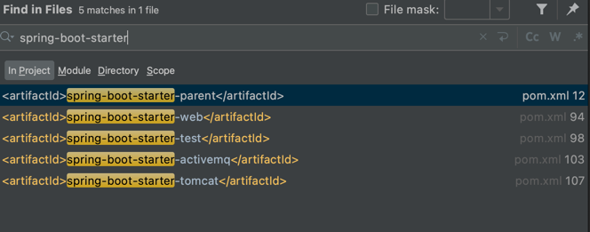

# Spring
### SpringCloud组件

- 注册中心,服务发现-Netflix Eureka
- 客服端负载均衡-Netflix Ribbon
- 容错管理工具-Netflix Hystrix
- 服务网关-Netflix Zuul,提供动态路由,监控,弹性,安全等边缘服务.
- 分布式配置-Spring Cloud Config
### SpringMvc
1. 工作流程

2. 九大组件
    1. HandlerMapping
    根据request找到相应的处理器。因为Handler（Controller）有两种形式，一种是基于类的Handler，另一种是基于Method的Handler（也就是我们常用的）
    2. HandlerAdapter
    调用Handler的适配器。如果把Handler（Controller）当做工具的话，那么HandlerAdapter就相当于干活的工人
    3. HandlerExceptionResolver
    对异常的处理
    4. ViewResolver
    用来将String类型的视图名和Locale解析为View类型的视图
    5. RequestToViewNameTranslator
    有的Handler（Controller）处理完后没有设置返回类型，比如是void方法，这是就需要从request中获取viewName
    6. LocaleResolver
    从request中解析出Locale。Locale表示一个区域，比如zh-cn，对不同的区域的用户，显示不同的结果，这就是i18n（SpringMVC中有具体的拦截器LocaleChangeInterceptor）
    7. ThemeResolver
    主题解析，这种类似于我们手机更换主题，不同的UI，css等
    8. MultipartResolver
    处理上传请求，将普通的request封装成MultipartHttpServletRequest
    9. FlashMapManager
    用于管理FlashMap，FlashMap用于在redirect重定向中传递参数

### Spring
#### Q0. Spring的核心
IOC:控制反转,原来我们使用对象是由使用者控制的,有了Spring了之后,可以将整个对象
交给容器来帮助我们管理. 
容器:存储对象,使用map结构存储对象,在spring中存储对象有三级缓存 
一级缓存singletonObjects存放完整对象  
二级缓存earlySingletonObjects存放半成品对象 
三级缓存singletonFactory用来存放lambda表达式和对象名称的映射 
整个bean的生命周期,从创建到销毁,都是由容器来帮我们实现的. 
DI:依赖注入,将对应的属性注入到对象中;常用@Autowired,@Resource,
populateBean方法来完成属性注入 
AOP:面向切面编程
- 代理模式:为其他对象提供一种代码以控制对这个对象的访问 
比如A对象要做一件事情，在没有代理前，自己来做，在对A代理后，由A的代理类B来做。代理其实是在原实例前后加了一层处理
- 静态代理:在程序运行前就已经存在代理类的字节码文件，代理类和原始类的关系在运行前就已经确定。 
代理对象的一个借口只服务于一种类型的对象,如果要代理的方法很多,就需要对每种方法都进行代理.
- 动态代理:在程序运行期间通过jvm反射等机制动态生产;代理类和委托类的关系是运行时才确定的. 
Spring AOP就是基于动态代理的，如果要代理的对象，实现了某个接口，那么Spring AOP会使用JDK Proxy;否则使用Cglib 
使用jdk生成的动态代理的前提是目标类必须有**实现的接口**。 
**Cglib**是以动态生成的**子类继承**目标的方式实现，在运行期动态的在内存中构建一个子类 
`public class UserDao{}
//Cglib是以动态生成的子类继承目标的方式实现,程序执行时,隐藏了下面的过程
public class $Cglib_Proxy_class  extends UserDao{}`
Cglib使用的前提是目标类不能为final修饰。因为final修饰的类不能被继承。 
AOP的作用:可以分离业务代码和关注点代码（重复代码），在执行业务代码时，动态的注入关注点代码。切面就是关注点代码形成的类。
#### Q1. Spring的bean的生命周期

对象生成:createBeanInstance - > populateBean -> invokeAwareMethods -> BeanPostProcessor前置处理方法 -> invokeInitMethods -> BeanPostProcessor后置处理方法
对象销毁:DisposableBean.destroy() -> destroyMethod
1. 实例化Bean对象,通过反射的方式来生成.在源码中有一个createBeanInstance的方法是专门来生成对象的.
1. 设置对象属性(依赖注入):当对象创建完成后,对象的属性值都是默认值,所以要开始给bean填充属性,通过populateBean方法来完成对象属性的填充
1. 向bean对象中设置容器属性(eg:BeanFactory,ApplicationContext),调用invokeAwareMethods方法来将容器对象设置到具体的bean对象中
1. 调用BeanPostProcessor中的前置处理方法来进行bean对象的扩展工作,eg:ApplicationContextPostProcessor,EmbeddValueResolver等对象
1. 调用invokeInitMethods方法来完成初始化方法的调用,再此方法处理过程中,需要判断当前bean对象是否实现了InitializingBean接口,如果实现了调用afterPropertiesSet方法来最后设置Bean对象
1. 调用BeanPostProcessor的后置处理方法,完成对Bean对象的后置处理工作,AOP就是在此处实现的,实现的接口名字叫做AbstractAutoProxyCreator
1. 获取到完整对象之后,通过getBean方法去进行对象的获取和使用
1. 当对象使用完成之后,在容器关闭的时候,会销毁对象,首先会判断是否实现了DisposableBean接口,然后再去调用destroyMethod
#### Q2. Spring中使用的设计模式
1. 工厂模式:BeanFactory就是简单工厂模式的体现,用来创建对象实例
1. 单例模式:Bean默认为单例模式
1. 代理模式:Spring的AOP功能用到了JDK的动态代理和CGLIB字节码生成技术；
1. 模版模式:用来解决代码重复的问题.eg:RestTemplate, JmsTemplate, JpaTemplate。
1. 观察者模式:定义对象键一种一对多的依赖关系，当一个对象的状态发生改变时，所有依赖于它的对象都会得到通知被制动更新，如Spring中listener的实现–ApplicationListener。
#### Q3. Spring中的事物传播特性以及隔离级别
- 七种事务传播属性

- 事务隔离级别

默认使用数据库默认的事务隔离级别.在进行配置的时候,如果数据库和Spring的配置不一致,以Spring的为准.
#### Q4.BeanFactory和ApplicationContext有什么区别？
BeanFactory和ApplicationContext是Spring的两大核心接口，都可以当做Spring的容器。其中ApplicationContext是BeanFactory的子接口。
1. BeanFactory：是Spring里面最底层的接口，包含了各种Bean的定义，读取bean配置文档，管理bean的加载、实例化，控制bean的生命周期，维护bean之间的依赖关系。
ApplicationContext接口作为BeanFactory的派生，除了提供BeanFactory所具有的功能外，还提供了更完整的框架功能
2. BeanFactroy采用的是延迟加载形式来注入Bean的，即只有在使用到某个Bean时(调用getBean())，才对该Bean进行加载实例化。
ApplicationContext，它是在容器启动时，一次性创建了所有的Bean。这样，在容器启动时，我们就可以发现Spring中存在的配置错误，这样有利于检查所依赖属性是否注入。
相对于基本的BeanFactory，ApplicationContext 唯一的不足是占用内存空间。当应用程序配置Bean较多时，程序启动较慢。
3. BeanFactory通常以编程的方式被创建，ApplicationContext还能以声明的方式创建，如使用ContextLoader。
4. BeanFactory和ApplicationContext都支持BeanPostProcessor、BeanFactoryPostProcessor的使用，但两者之间的区别是：BeanFactory需要手动注册，而ApplicationContext则是自动注册。
#### Q5.Spring支持的几种bean的作用域
- singleton:默认,每个容器中只有一个bean实例,单例模式由BeanFactory自身来维护
- prototype:为每一个bean请求提供一个实例
- request:为每一个网络请求创建一个实例,在请求完成之后,bean会失效并被垃圾回收器回收
- session:与request类似,确保每一个session中有一个bean实例,在session过期后,bean随之失效
- global-sessiion:全局作用域
#### Q6.Spring框架中的单例bean是线程安全的么?
不是,Spring框架中的单例Bean不是线程安全的 
Spring中的Bean默认是单例模式,Spring框架并没有对单例bean进行多线程的封装处理. 
实际大部分使用过程中的spring bean是无状态的(eg:dao类),所以某种程度上来说也是安全的,
但是如果bean有状态的话,就需要开发者自己保证线程安全了 
最简单的方式就是改变bean的作用域,singleton->prototype,这样请求bean相当于new Bean()了,所以就可以保证线程安全了
#### Q7.什么是bean装配，spring 自动装配 bean 有哪些方式？
装配或者Bean装配,就是指在Spring容器中把bean组装到一起,前提是容器需要知道bean的依赖关系,如何通过依赖注入来把它们装配到一起.
在Spring框架中xml配种中共有5种自动装配:
- no：默认的方式是不进行自动装配的，通过手工设置ref属性来进行装配bean。
- byName：通过bean的名称进行自动装配，如果一个bean的 property 与另一bean 的name 相同，就进行自动装配。
- byType：通过参数的数据类型进行自动装配。
- constructor：利用构造函数进行装配，并且构造函数的参数通过byType进行装配。
- autodetect：自动探测，如果有构造方法，通过 construct的方式自动装配，否则使用 byType的方式自动装配。
例如使用@Autowired注解自动装配：
使用@Autowired注解来自动装配指定的bean。在使用@Autowired注解之前需要在Spring配置文件进行配置<context:annotation-config />，表示开启自动装配。
在启动spring IoC时，容器自动装载了一个AutowiredAnnotationBeanPostProcessor后置处理器，当容器扫描到@Autowired、@Resource或@Inject时，就会在IoC容器自动查找需要的bean，并装配给该对象的属性。在使用@Autowired时，首先在容器中查询对应类型的bean：
- 如果查询结果刚好为一个，就将该bean装配给@Autowired指定的数据；
- 如果查询的结果不止一个，那么@Autowired会根据名称来查找；
- 如果上述查找的结果为空，那么会抛出异常。解决方法时，使用required=false。
@Autowired默认是按照类型装配注入的，默认情况下它要求依赖对象必须存在（可以设置它required属性为false）。@Autowired 注解提供了更细粒度的控制，包括在何处以及如何完成自动装配。它的用法和@Required一样，修饰setter方法、构造器、属性或者具有任意名称和/或多个参数的PN方法。
#### Q8.Spring通知有哪些类型？
Spring切面可以应用5种类型的通知：
1. 前置通知（Before）：在目标方法被调用之前调用通知功能；
2. 后置通知（After）：在目标方法完成之后调用通知，此时不会关心方法的输出是什么；
3. 返回通知（After-returning ）：在目标方法成功执行之后调用通知；
4. 异常通知（After-throwing）：在目标方法抛出异常后调用通知；
5. 环绕通知（Around）：通知包裹了被通知的方法，在被通知的方法调用之前和调用之后执行自定义的行为。
#### Q9.@Component, @Controller, @Repository, @Service 有何区别？
@Component：这将 java 类标记为 bean。它是任何 Spring 管理组件的通用构造型。spring 的组件扫描机制现在可以将其拾取并将其拉入应用程序环境中。
@Controller：这将一个类标记为 Spring Web MVC 控制器。标有它的 Bean 会自动导入到 IoC 容器中。
@Service：此注解是组件注解的特化。它不会对 @Component 注解提供任何其他行为。您可以在服务层类中使用 @Service 而不是 @Component，因为它以更好的方式指定了意图。
@Repository：这个注解是具有类似用途和功能的 @Component 注解的特化。它为 DAO 提供了额外的好处。它将 DAO 导入 IoC 容器，并使未经检查的异常有资格转换为 Spring DataAccessException。
#### Q10.BeanFactory与FactoryBean的区别
BeanFactory与FactoryBean都可以用来创建对象,只不过创建对象的流程不同.
BeanFactory创建对象必须严格遵守bean的生命周期,经过一系列复杂的步骤之后才能完成创建
FactoryBean是用户可以自定义bean对象的创建流程,不需要按照bean的生命周期来进行创建.eg:SqlSessionFactoryBean
FactoryBean在接口中包含了三个方法
1. isSingleton:判断当前对象是否为单例对象
2. getObjectType:获取对象的类型
3. getObject:再次方法创建对象,使用new或者使用代理的方式都可以,用户可以按照自己的需要去创建
#### Q11.Spring如何解决循环依赖
循环依赖三种情况
1. A依赖B,B依赖A
1. A依赖B,B依赖C,C依赖A
1. A依赖A

简言之，两个池子：一个成品池子，一个半成品池子。能解决循环依赖的前提是：spring开启了allowCircularReferences，那么一个正在被创建的bean才会被放在半成品池子里。在注入bean，向容器获取bean的时候，优先向成品池子要，要不到，再去向半成品池子要。 
出现循环依赖一定是你的业务设计有问题。高层业务和底层业务的划分不够清晰，一般，业务的依赖方向一定是无环的，有环的业务，在后续的维护和拓展一定非常鸡肋 
存放在二级缓存中的是objectFactory而不是直接是Object的原因:
利于拓展，程序员可以通过beanPostProcess接口操作objectFactory对象生成自己想要的对象 

无法解决循环依赖的场景
1. 对象作用域为单例的时候不能解决循环依赖,原因:因为单例是spring在启动时进行bean加载放入单例池中，在依赖的bean开始生命周期后，可以直接从二级缓存中取到它所依赖的bean的objectFactory对象从而结束循环依赖。而原型只有在用到时才会走生命周期流程，但是原型不存在一个已经实例化好的bean，所以会无限的创建-依赖-创建-依赖
1. 不支持通过构造方法进行注入(通过构造方法创建的时候对象还未实例化)

#### Q12.Spring boot启动的原理
1. SpringBoot 在启动时会去依赖的 Starter 包中寻找 resources/META-INF/spring.factories 文件，然后根据文件中配置的 Jar 包去扫描项目所依赖的 Jar 包。
2. 根据 spring.factories 配置加载 AutoConfigure 类
3. 根据 @Conditional 注解的条件，进行自动配置并将 Bean 注入 Spring Context 

SpringBoot 在启动的时候，按照约定去读取 SpringBoot Starter 的配置信息，再根据配置信息对资源进行初始化，并注入到 Spring 容器中。这样 SpringBoot 启动完毕后，就已经准备好了一切资源，使用过程中直接注入对应 Bean 资源即可。
#### Q13.Spring boot自动配置原理
**约定大于配置**

@SpringBootApplication等同于下面三个注解：

- @SpringBootConfiguration：我们点进去以后可以发现底层是Configuration注解，说白了就是支持JavaConfig的方式来进行配置(使用Configuration配置类等同于XML文件)。
- @EnableAutoConfiguration：开启自动配置功能(后文详解)
- @ComponentScan：扫描注解，默认是扫描当前类下的package。将@Controller/@Service/@Component/@Repository等注解加载到IOC容器中。

其中@EnableAutoConfiguration是关键(启用自动配置)，内部实际上就去加载META-INF/spring.factories文件的信息，然后筛选出以EnableAutoConfiguration为key的数据，加载到IOC容器中，实现自动配置功能！
#### Q14.Spring boot两大核心配置
SpringBoot 的核心配置文件是 application 和 bootstrap 配置文件。 
application.properties 可以配置队列，项目启动端口、hdfs配置 
bootstrap使用 Spring Cloud Config 配置中心时，这时需要在 bootstrap 配置文件中添加连接到配置中心的配置属性来加载外部配置中心的配置信息；
一些固定的不能被覆盖的属性；
一些加密/解密的场景；
#### Q15.Spring boot加载顺序
由jar包外向jar包内进行寻找; 优先加载带profile,再来加载不带profile
1. jar包外部的application-{profile}.properties或application.yml(带spring.profile配置文件
2. jar包内部的application-{profile}.properties或application.yml(带spring.profile配置文件
3. jar包外部的application.properties或application.yml(不带spring.profile配置文件
4. jar包内部的application.properties或application.yml(不带spring.profile配置文件
#### Q16 使用过哪些Spring boot start

