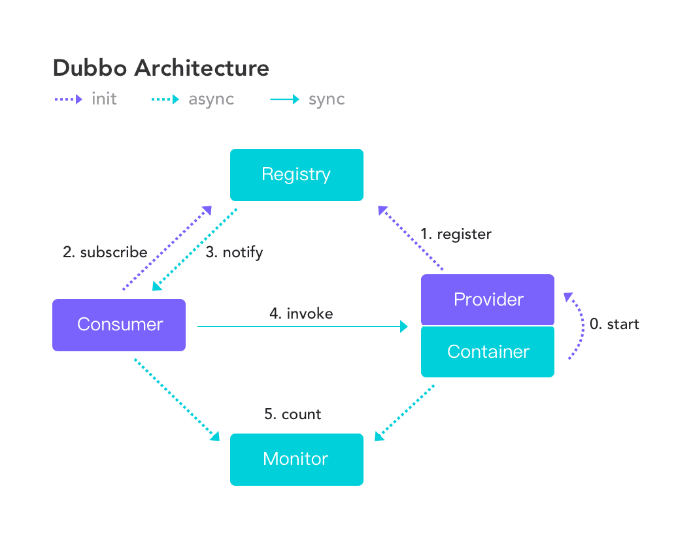
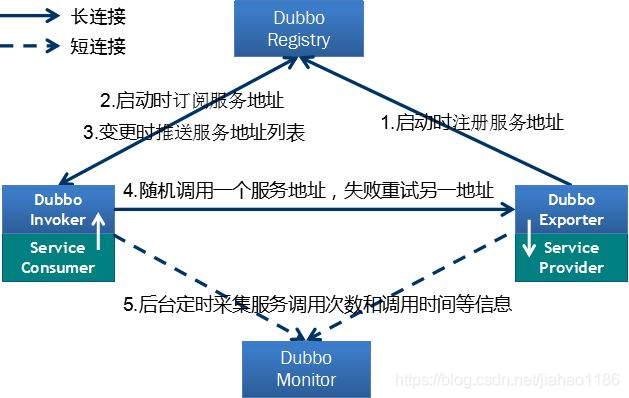
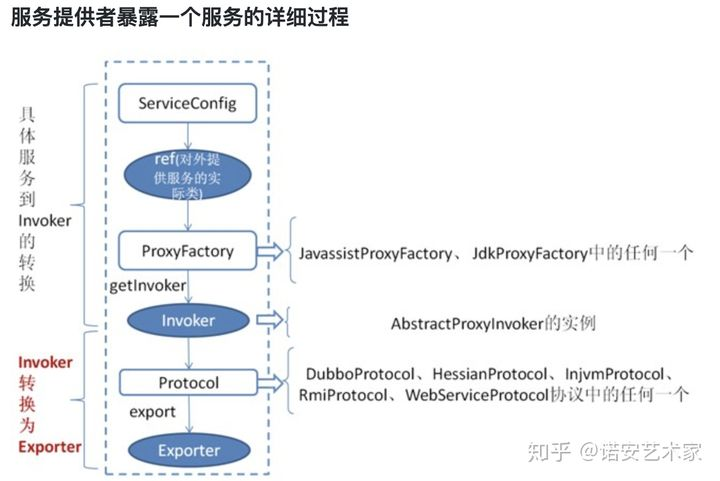
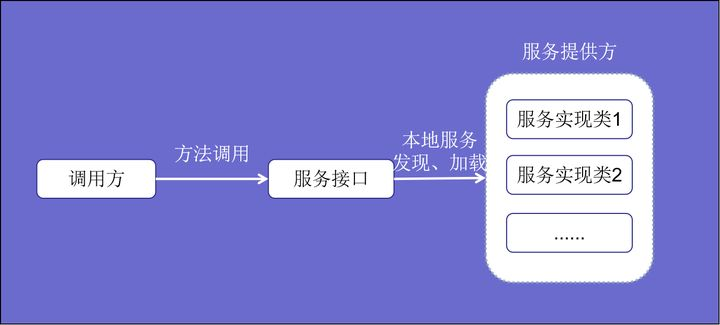
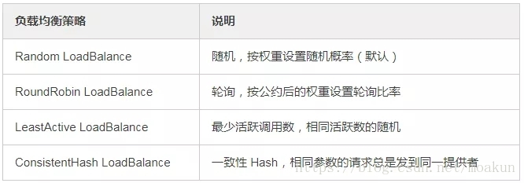

# dobbo
https://zhuanlan.zhihu.com/p/45846108
#### Q0 什么是RPC
RPC (Remote Procedure Call)是远程过程调用，比如说现在有两台服务器A, B，一个在A服务器上的应用想要调用B服务器上的应用提供的某个，由于不在两个方法不在一个内存空间，不能直接调用，需要通过网络表达调用的语义和传达调用的数据。常存在于分布式系统中。

RPC跟HTTP不是对立面，RPC中可以使用HTTP作为通讯协议。RPC是一种设计、实现框架，通讯协议只是其中一部分。

RPC的本质是提供了一种轻量无感知的跨进程通信的方式，在分布式机器上调用其他方法与本地调用无异（远程调用的过程是透明的，你并不知道这个调用的方法是部署在哪里，通过PRC能够解耦服务）。RPC是根据语言的API来定义的，而不是基于网络的应用来定义的，调用更方便，协议私密更安全、内容更小效率更高。
#### Q1 dubbo架构设计
https://dubbo.apache.org/zh/docs/concepts/registry-configcenter-metadata/

服务发现的一个核心组件是注册中心，Provider 注册地址到注册中心，Consumer 从注册中心读取和订阅 Provider 地址列表。
#### Q2 服务注册与发现的流程图

#### Q2 dubbo服务本地暴露和远程暴露的区域,服务暴露的流程
https://zhuanlan.zhihu.com/p/261360323
本地暴露是暴露在JVM中，不需要网络通信。每个服务默认都会在本地暴露。在引用服务的时候，优先引用本地服务。

远程暴露是将IP，端口等信息暴露给远程客户端，调用时需要网络通信

服务暴露过程： 
为真实对象创建代理Invoker（ServiceBean -> Invoker）； 
使用相关的协议暴露服务（Invoker -> Exporter）； 
暴露过程中会先将Exporter对象会放到Map中维护，同时会打开服务（默认创建NettyServer);打开Server之后，会注册服务的元数据（默认注册中心使用Zookeeper） 
先本地服务暴露，这样到会如果有本地调用，直接从本地服务调用即可，不必发起远程调用； 
所有真实对象调用都是委托给代理，通过代理创建Invoker对象来实现调用； 
服务暴露时会根据具体的协议执行相应的操作； 
#### Q2 dubbo服务引入的流程
https://www.jianshu.com/p/08e7bb028d64
1. consumer端在初始化bean后的afterPropertiesSet()方法中进行初始化动作。
2. consumer注册自身到zk的/dubbo/xxx_interface/consumer节点下面
3. consumer订阅zk的/dubbo/xxx_interface/provider|configor|routers服务
4. 订阅节点有变化的时候通知变更
5. 所有订阅的服务保存在RegistyDirectory目录中供发起RPC调用的时候cluster调用
#### Q2 dubbo服务调用流程
https://zhuanlan.zhihu.com/p/224938929
合并服务的暴露与引入
#### Q2 什么是SPI以及Dubbo不用JDK SPI要自己实现的原因
https://zhuanlan.zhihu.com/p/148144666 
SPI 全称为 Service Provider Interface，是一种服务发现机制。SPI 的本质是将接口实现类的全限定名配置在文件中，并由服务加载器读取配置文件，加载实现类。 
这样可以在运行时，动态为接口替换实现类。 
SPI实际上是“接口+策略模式+配置文件”实现的动态加载机制。在系统设计中，模块之间通常基于接口编程，不直接显示指定实现类。一旦代码里指定了实现类，就无法在不修改代码的情况下替换为另一种实现。为了达到动态可插拔的效果，java提供了SPI以实现服务发现。 

java原生SPI有以下几个缺点：
- 需要遍历所有的实现并实例化，无法只加载某个指定的实现类，加载机制不够灵活；
- 配置文件中没有给实现类命名，无法在程序中准确的引用它们；
- 没有使用缓存，每次调用load方法都需要重新加载
  如果想使用Dubbo SPI，接口必须打上@SPI注解。相比之下，Dubbo SPI有以下几点改进：
- 配置文件改为键值对形式，可以获取任一实现类，而无需加载所有实现类，节约资源；
- 增加了缓存来存储实例，提高了读取的性能
- dubbo SPI还提供了对IOC和AOP等高级功能的支持，以实现更多类型的扩展。
#### Q2 dubbo集群容错策略
- Failover Cluster:
1. 失败自动切换，当出现失败，重试其它服务器。(缺省)
2. 通常用于**读操作**，但重试会带来更长延迟。
   可通过retries="2"来设置重试次数(不含第一次)。
- Failfast Cluster:
1. 快速失败，只发起一次调用，失败立即报错。
2. 通常用于非幂等性的**写操作**，比如新增记录。
   Failsafe Cluster:
1. 失败安全，出现异常时，直接忽略。
2. 通常用于写入审计日志等操作。
- Failback Cluster:安全失败
1. 失败自动恢复，后台记录失败请求，定时重发。
2. 通常用于消息通知操作。
- Forking Cluster:
1. 并行调用多个服务器，只要一个成功即返回。
2. 通常用于实时性要求较高的读操作，但需要浪费更多服务资源。
3. 可通过forks="2"来设置最大并行数。
- Broadcast Cluster
1. 广播调用所有提供者，逐个调用，任意一台报错则报错。(2.1.0开始支持)
2. 通常用于通知所有提供者更新缓存或日志等本地资源信息。
#### Q2 dubbo服务引负债均衡策略

`<dubbo:service interface="..."loadbalance=" random "/>
或：
<dubbo:reference interface="..."loadbalance=" random "/>`
- 随机 
按权重设置随机概率。在一个截面上碰撞的概率高，但调用量越大分布越均匀，而且按概率使用权重后也比较均匀，有利于动态调整提供者权重。(权重可以在dubbo管控台配置)
- 轮循 
按公约后的权重设置轮循比率。存在慢的提供者累积请求问题，比如：第二台机器很慢，但没挂，当请求调到第二台时就卡在那，久而久之，所有请求都卡在调到第二台上。
- 最少活跃调用数 
相同活跃数的随机，活跃数指调用前后计数差。使慢的提供者收到更少请求，因为越慢的提供者的调用前后计数差会越大。
- 一致性Hash 
相同参数的请求总是发到同一提供者。当某一台提供者挂时，原本发往该提供者的请求，基于虚拟节点，平摊到其它提供者，不会引起剧烈变动。
#### Q2 dubbo支持的协议有哪些?缺省值是?
- dubbo协议(默认):单一长连接，NIO异步通信，基于hessian作为序列化协议
适用的场景就是：传输数据量很小（每次请求在100kb以内），但是并发量很高
- rmi协议:走java二进制序列化，多个短连接，适合消费者和提供者数量差不多，适用于文件的传输，一般较少用
- hessian协议:走hessian序列化协议，多个短连接，适用于提供者数量比消费者数量还多，适用于文件的传输，一般较少用
- http协议:基于 Http 表单提交的远程调用协议，使用 Spring 的
HttpInvoke 实现。多个短连接，传输协议 HTTP，传入参数大小混
合，提供者个数多于消费者，需要给应用程序和浏览器 JS 调用；
- webservice协议:基于 WebService 的远程调用协议，集成 CXF 实现，
提供和原生 WebService 的互操作。多个短连接，基于 HTTP 传输，
同步传输，适用系统集成和跨语言调用；
#### Q2 dubbo支持的序列化方式?缺省值是?
- dubbo序列化：阿里尚未开发成熟的高效java序列化实现，阿里不建议在生产环境使用它
- hessian2序列化(默认推荐)：hessian是一种跨语言的高效二进制序列化方式。但这里实际不是原生的hessian2序列化，而是阿里修改过的hessian lite，它是dubbo RPC默认启用的序列化方式
- json序列化：目前有两种实现，一种是采用的阿里的fastjson库，另一种是采用dubbo中自己实现的简单json库，但其实现都不是特别成熟，而且json这种文本序列化性能一般不如上面两种二进制序列化。
- java序列化：主要是采用JDK自带的Java序列化实现，性能很不理想。
#### Q2 服务提供者能实现失效踢出是什么原理？
服务失效踢出基于zookeeper的临时节点原理。
#### Q2 dubbo3.0新特性
https://dubbo.apache.org/zh/docs/v3.0/new-in-dubbo3/
- 全新服务发现模型 
相比于 2.x 版本中的基于接口粒度的服务发现机制，3.x 引入了全新的基于应用粒度的服务发现机制， 新模型带来两方面的巨大优势：
进一步提升了 Dubbo3 在大规模集群实践中的性能与稳定性。新模型可大幅提高系统资源利用率，降低 Dubbo 地址的单机内存消耗（50%），降低注册中心集群的存储与推送压力（90%）， Dubbo 可支持集群规模步入百万实例层次。
打通与其他异构微服务体系的地址互发现障碍。新模型使得 Dubbo3 能实现与异构微服务体系如Spring Cloud、Kubernetes Service、gRPC 等，在地址发现层面的互通， 为连通 Dubbo 与其他微服务体系提供可行方案。
在 Dubbo3 前期版本将会同时提供对两套地址发现模型的支持，以最大程度保证业务升级的兼容性。
- 下一代RPC通信协议 
定义了全新的 RPC 通信协议 – Triple，一句话概括 Triple：它是基于 HTTP/2 上构建的 RPC 协议，完全兼容 gRPC，并在此基础上扩展出了更丰富的语义。 使用 Triple 协议，用户将获得以下能力
更容易到适配网关、Mesh架构，Triple 协议让 Dubbo 更方便的与各种网关、Sidecar 组件配合工作。
多语言友好，推荐配合 Protobuf 使用 Triple 协议，使用 IDL 定义服务，使用 Protobuf 编码业务数据。
流式通信支持。Triple 协议支持 Request Stream、Response Stream、Bi-direction Stream
- 云原生 
Dubbo3 构建的业务应用可直接部署在 VM、Container、Kubernetes 等平台，Dubbo3 很好的解决了 Dubbo 服务与调度平台之间的生命周期对齐，Dubbo 服务发现地址 与容器平台绑定的问题。
- 0c5a7dd4.png
  92d4076f.png
  bf4c8fcb.png
  c1bcabd5.png
  c567e5ff.png扩展点分离
Dubbo3 的 maven 也发生了一些变化，org.apache.dubbo:dubbo:3.0.0 将不再是包含所有资源的 all-in-one 包，一些可选的依赖已经作为独立组件单独发布， 因此如果用户使用了不在 dubbo 核心依赖包中的独立组件，如 registry-etcd、rpc-hessian 等，需要为这些组件在 pom.xml 中单独增加依赖包。