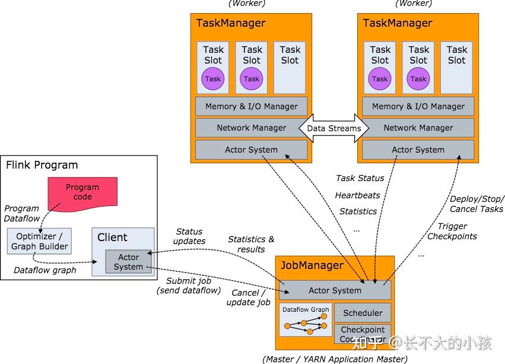

# flink
#### Q0 flink简介
Flink 是大数据领域的分布式实时和离线计算引擎，其程序的基础构建模块是流（Streams）和转换（Transformations），每一个数据流起始于一个或多个 Source，并终止于一个或多个 Sink，数据流类似于有向无环图（DAG）。 
Flink 提供了诸多高抽象层的 API 以便用户编写分布式任务：DataSet API、DataStream API、Table API 
flink特性：
- 高效的状态管理，Flink自带的StateBackend可以很好的存储中间状态信息；
- 丰富的窗口支持，Flink支持包含滚动窗口、滑动窗口及其他窗口；
- 多种时间语义，Flink支持EventTime、ProcessingTime和IngestionTime；
- 不同级别的容错，Flink支持AtLeastOnce或ExactlyOnce容错级别。
#### Q1 flink和storm对比

#### Q2 flink集群的角色

- JobManager：**集群管理者**。负责接收Flink Job、任务调度、协调checkpoint、故障恢复、收集job的状态信息，管理flink集群中的从节点TaskManager
- TaskManager：**执行计算的Worker**。负责管理其所在节点上的资源信息，把该节点上的服务信息如内存、磁盘、任务运行情况等向JobManager汇报
- Client：Flink **程序提交的客户端**。用户在提交编写好的Flink程序时，会先创建一个Client，Client 需要从用户提交的 Flink 程序配置中获取 JobManager 的地址，并建立到 JobManager 的连接，将 Flink Job 提交给 JobManager。Client 会根据用户传入的参数选择使用 yarn per job、stand-alone、yarn-session 模式将 Flink 程序提交到集群。
#### Q3 flink组件以及各自的作用

组件栈：DataStream/DataSet API ——》Table API ——》SQL

数据流模型：Flink程序在执行的时候会被映射成一个数据流模型（Streaming Dataflows）

Flink 程序的基本构建是数据输入来自一个 Source，Source 代表数据的输入端，经过 Transformation 进行转换，然后在一个或者多个 Sink 接收器中结束。数据流（Stream）就是一组永远不会停止的数据记录流，而转换（Transformation）是将一个或多个流作为输入，并生成一个或多个输出流的操作。
- DataFlow：Flink程序在执行的时候会被映射成一个数据流模型（Streaming Dataflows）
- Operator：数据流模型中的每一个操作被称为Operator,Operator分为：Source/Transformation/Sink
- Partition：数据流模型是分布式的和并行的，执行中会形成1~n个分区
- SubTask：多个分区任务可以并行，每一个都是独立运行在一个线程中，也就是一个SubTask子任务中
- Parallelism：并行度，就是可以同时真正执行的子任务数/分区数
#### Q4 Task Slot 进行资源管理

1. TaskSlot（任务槽）：

如上图，在 Flink 集群中，一个 TaskManger就是一个JVM进程，为了控制一个 TaskManger 能接收多少个 task，Flink 提出了 TaskSlot 的概念。

一个TaskManager进程中可以同时运行多少个线程由TaskSlot决定，TaskSlot是TaskManager中的最小资源分配单位，一个TaskManager中有多少个TaskSlot就意味着能支持多少并发的Task处理。

TaskSlot 仅仅用来做内存的隔离，对CPU不起作用。

2. Slot Sharing(槽共享)：

如下图，Flink允许将不能形成算子链的两个操作，比如map()、keyBy()、sink() 放在一个 TaskSlot 里执行以达到资源共享的目的。

#### Q5 Flink 是如何容错的
Flink 实现容错主要靠强大的 **CheckPoint** 机制和 **State** 机制。
- Checkpoint 负责定时制作分布式快照、对程序中的状态进行备份；
- State 用来存储计算过程中的中间状态。
#### Q6 Flink如何保证 exactly-Once 语义
Flink 通过实现两阶段提交和状态保存来实现端到端的一致性语义。分为以下几个步骤：
1. 开始事务（beginTransaction）创建一个临时文件夹，来写把数据写入到这个文件夹里面
2. 预提交（preCommit）将内存中缓存的数据写入文件并关闭
3. 正式提交（commit）将之前写完的临时文件放入目标目录下。这代表着最终的数据会有一些延迟
4. 丢弃（abort）丢弃临时文件

若失败发生在预提交成功后，正式提交前。可以根据状态来提交预提交的数据，也可删除预提交的数据。

#### Q7 Flink Operator Chains（算子链）

1.Operator传递模式
- One to One模式：上下游数据的分区数和排序一致，类似于Spark中的窄依赖。
- Redistributing模式：会改变数据的分区数，类似于Spark中的宽依赖。
客户端在提交任务的时候会对Operator进行优化操作，Flink会将One to One模式的算子合并，合并后的Operator称为Operator Chain（执行链），每个Operator Chain会在TaskManager上一个独立的线程中执行，就是SubTask。
2. Flink 采用了一种称为任务链（Operator Chains）的优化技术可以减少：
- 线程之间的切换；
- 消息的序列化/反序列化；
- 数据在缓冲区的交换；
- 延迟的同时提高整体的吞吐量。
#### Q8  Flink 中的时间分类
- 事件时间（Event Time），即事件实际发生的时间；
- 摄入时间（Ingestion Time），事件进入流处理框架的时间；
- 处理时间（Processing Time），事件被处理的时间。
#### Q9  Flink watermark 
水印的出现是为了解决实时计算中的**数据乱序问题**，它的本质是 DataStream 中一个带有时间戳的元素。如果 Flink 系统中出现了一个 WaterMark T，那么就意味着 EventTime < T 的数据都已经到达，窗口的结束时间和 T 相同的那个窗口被触发进行计算了。

也就是说：水印是 Flink 判断迟到数据的标准，同时也是窗口触发的标记。

Flink 中的水印有两种：
- 周期生成水印 AssignerWithPeriodicWatermarks，周期默认的时间是 200ms；
- 按需要生成水印 PunctuatedWatermark，它适用于根据接收到的消息判断是否需要产生水印。
#### Q10  Flink 窗口类型
根据窗口数据划分的不同，目前 Flink 支持如下 3 种：
- 滚动窗口，窗口数据有固定的大小，窗口中的数据不会叠加；
- 滑动窗口，窗口数据有固定的大小，并且有生成间隔；
- 会话窗口，窗口数据没有固定的大小，根据用户传入的参数进行划分，窗口数据无叠加。

