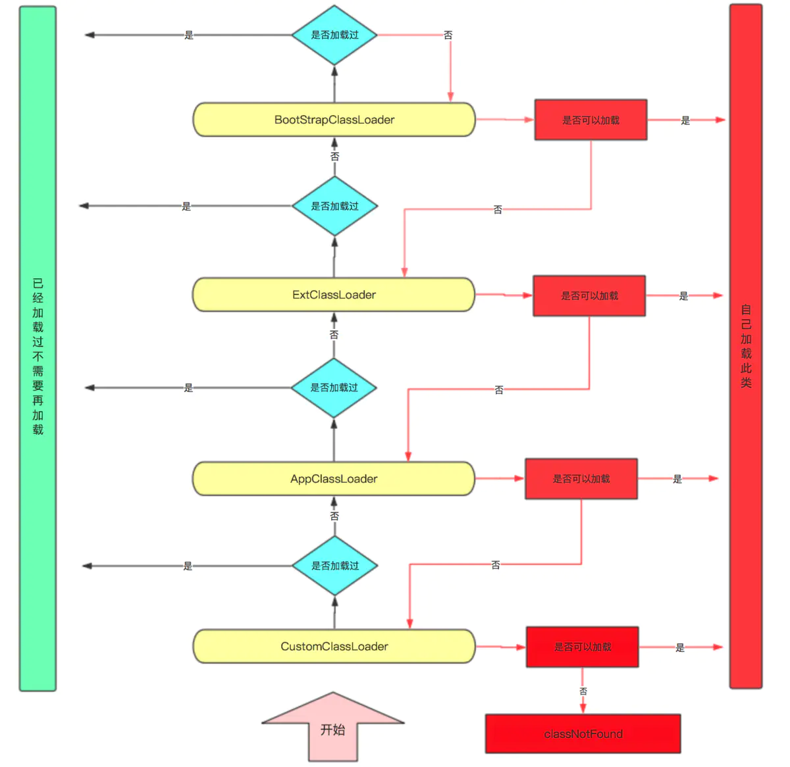

# java基础
#### Q0:简述面向对象
**封装**：封装的目的在于保护信息Java;提供了私有和公有的访问模式，类的公有接口代表外部的用户应该知道或可以知道的每件东西，私有的方法数据只能通过该类的成员代码来访问，这就可以确保不会发生不希望的事情。增加代码**复用性** 
**继承**：程序中的继承性是指子类拥有父类的全部特征和行为，这是类之间的一种关系。Java 只支持单继承。增加代码**复用性** 
**多态**：多态性允许一个接口被多个同类使用,增加代码可**移植性、灵活性**. 
#### Q1:BIO、NIO、AIO的概念和区别
https://segmentfault.com/a/1190000012976683  
BIO 阻塞同步通信模式，客户端和服务器连接需要三次握手，使用简单，但吞吐量小 
NIO 非阻塞同步通信模式，客户端与服务器通过Channel连接，采用多路复用器轮询注册的Channel。提高吞吐量和可靠性。 
AIO 非阻塞异步通信模式，NIO的升级版，采用异步通道实现异步通信，其read和write方法均是异步方法。 
同步阻塞IO : 用户进程发起一个IO操作以后，必须等待IO操作的真正完成后，才能继续运行。 
同步非阻塞IO: 用户进程发起一个IO操作以后，可做其它事情，但用户进程需要经常询问IO操作是否完成，这样造成不必要的CPU资源浪费。 
异步非阻塞IO: 用户进程发起一个IO操作然后，立即返回，等IO操作真正的完成以后，应用程序会得到IO操作完成的通知。类比Future模式。 
#### Q2:NIO:select、poll和epoll的区别
https://zhuanlan.zhihu.com/p/272891398  
select，poll实现需要自己不断轮询所有fd集合，直到设备就绪，期间可能要睡眠和唤醒多次交替。而epoll其实也需要调用epoll_wait不断轮询就绪链表，期间也可能多次睡眠和唤醒交替，但是它是设备就绪时，调用回调函数，把就绪fd放入就绪链表中，并唤醒在epoll_wait中进入睡眠的进程。虽然都要睡眠和交替，但是select和poll在“醒着”的时候要遍历整个fd集合，而epoll在“醒着”的时候只要判断一下就绪链表是否为空就行了，这节省了大量的CPU时间。这就是回调机制带来的性能提升。 
select，poll每次调用都要把fd集合从用户态往内核态拷贝一次，并且要把current往设备等待队列中挂一次，而epoll只要一次拷贝，而且把current往等待队列上挂也只挂一次（在epoll_wait的开始，注意这里的等待队列并不是设备等待队列，只是一个epoll内部定义的等待队列）。这也能节省不少的开销。 
#### Q3:JDK,JRE,JVM

#### Q4: ==和equals
== 对比的是栈中的值,基本数据类型是变量值,引用类型是堆中内存对象的地址
equals:Object默认也是采用==比较,通常会重写

#### Q5: final
final作用:
- 当它修饰类的时候表示该类是不能被继承的，因为抽象类就是用来被继承的，所以abstract关键字和final关键字不能共存。
- 当它修饰方法的时候表示该方法是不能被重写的。
- 当它修饰变量的时候表示该变量的值不能发生变化也就是该变量为一个常量。对于用final修饰的变量我们必须在申明它的时候赋值或者是在构造函数中给它赋值。
- 为什么局部内部类和匿名内部类只能访问局部final变量: 
内部类不会因为定义在方法中就随着方法的执行完毕被销毁;当外部类的方法结束时,局部变量就会被销毁,但是内部类对象可能还存在. 
这里就出现了一个矛盾,内部类对象访问了一个不存在的变量.为了解决这个问题,就将局部变量复制一份作为内部类的成员变量, 
这样当局部变量死亡后,内部类依然可以访问它. 
将局部变量复制位内部类的成员变量时,必须保证着两个变量是一只的,所以需要将局部变量设置为final. 
#### Q6: String、StringBuffer、StringBuilder
- String是final修饰的,不可变,每次操作都会产生新的String对象
- StringBuffer、StringBuilder都是在原对象上操作
- StringBuffer线程安全(方法syncchronized修饰);StringBuilder线程不安全
- 优先使用StringBuilder,多线程使用共享变量时使用StringBuffer.
#### Q7: 重载、重写的区别
- 重载: 发生在同一个类中,方法名称必须相同,参数类型不同、个数不同、顺序不同,方法返回值和访问修饰符可以不同,发生在编译时.
- 重写: 发生在父子类中,方法名、参数列表必须相同,返回值范围小于等于父类,抛出异常范围消息等于父类,访问修饰符范围大于等于父类;
如果父类方法访问修饰为private则子类就不能重写该方法

#### Q8: 接口和抽象类
- 抽象类可以存在普通成员函数,而接口中只能存在抽象方法
- 抽象类中的成员变量可以是各种类型的,而接口中的成员变量只能是public static final类型的
- 抽象类只能继承一个,接口可以实现多个
接口的设计目的,是对类进行行为的约束,对行为的抽象,类似于like a  
抽象类的设计目的是代码的服用,对类本质进行抽象,类似于 is a  
当关注一个事物的本省的时候,使用抽象类;当关注一个操作行为的时候,用接口 

#### Q11: hashcode和equals
hashCode()方法是Object类提供的，所以每个对象都有hashCode()方法，Object类的hashCode()方法默认是native的实现，可以认为不存在性能问题，因此不去仔细追究。 
hashCode()方法主要用来配合散列集合的一些操作，比如计算索引。 
在HashSet中判断对象是否存在集合中 
1. 调用obj.hashCode()，得到对应的hashcode值。
2. 如果集合中没有存储这个hashcode对应的对象，则直接添加。如果集合中已经存储了这个hashcode对应的对象，则调用equals判断是否对象相同。

为了保证equals方法返回的结果和hashCode方法返回的结果一样，所以重写equals方法的同时也要重写hashCode方法。 
hashCode()的默认行为是堆上的对象产生独特值.如果没有重写hashCode()方法,则该class的两个对象无论如何都不想等(即使这两个对象指向相同的数据) 
#### Q11: 什么是字节码,作用是什么
在 Java 中，JVM可以理解的代码就叫做字节码（即扩展名为 .class 的文件），它不面向任何特定的处理器，只面向虚拟机。Java 语言通过字节码的方式，在一定程度上解决了传统解释型语言执行效率低的问题，
同时又保留了解释型语言可移植的特点。所以 Java 程序运行时比较高效，而且，由于字节码并不针对一种特定的机器，因此，Java程序无须重新编译便可在多种不同操作系统的计算机上运行。
#### Q12: java类加载器
classloader顾名思义，即是类加载。虚拟机把描述类的数据从class字节码文件加载到内存，并对数据进行检验、转换解析和初始化，最终形成可以被虚拟机直接使用的Java类型，这就是虚拟机的类加载机制。
Java虚拟机会创建三类ClassLoader,分别是
- BootStrap ClassLoader(启动类加载器):<JAVA_HOME>/lib目录下并且被虚拟机识别的类库加载到虚拟机内存中。我们常用基础库，例如java.util.**，java.io.**，java.lang.**等等都是由根加载器加载。
- Extension ClassLoader(扩展类加载器):负责加载JVM扩展类，比如swing系列、内置的js引擎、xml解析器等，这些类库以javax开头，它们的jar包位于<JAVA_HOME>/lib/ext目录中。
- APP ClassLoader(应用类加载器,也称为系统类加载器):它负责加载用户路径(ClassPath)上所指定的类库。

类加载的过程:
类从被加载到虚拟机内存到被卸载，整个完整的生命周期包括：类加载、验证、准备、解析、初始化、使用和卸载七个阶段。其中验证，准备，解析三个部分统称为连接。
#### Q13: 双亲委派模型

1. 防止重复加载同一个.class。通过委托去向上面问一问，加载过了，就不用再加载一遍。保证数据安全。
2. 保证核心.class不能被篡改。通过委托方式，不会去篡改核心.clas，即使篡改也不会去加载，即使加载也不会是同一个.class对象了。不同的加载器加载同一个.class也不是同一个Class对象。这样保证了Class执行安全。
#### Q14: java中的异常体系
Java中的异常类均以Throwable为父类，而Throwable又派生出Error类和Exception类这两大子类。 
Error类及其子类，代表了JVM自身的异常。这一类异常发生时，无法通过程序来修正。最可靠的方式就是尽快地停止JVM的运行。 
Exception类及其子类，代表程序运行中发生了意料之外的事情。这些意外的事情可以被Java异常处理机制处理。而Exception类及其子类又可以划分为两大类： 
RuntimeException及其子类：这一类异常其实是程序设计的错误，通过修正程序设计是可以避免的。例如，数组越界异常、数值异常等。 
非RuntimeException及其子类：这一类异常的发生通常由外部因素导致，是不可预知和避免的。例如，IO异常、类型寻找异常等 
#### Q15: static关键词的作用
1. 修饰成员变量:该类的所有对象共享这个成员变量;只要类被加载就会被分配到内存中.
1. 修饰成员方法:被static修饰的方式是该类的方法,不需要创建对象就可以调用
1. 修饰代码块:static修饰代码块，会在类被加载的时候执行且仅会被执行一次，一般用来初始化静态变量和调用静态方法
1. 修饰内部类:这样可以不依赖与外部类实例对象而被实例化，而通常的内部类需要外部类实例化后才能实例化。
#### Q16: java类的加载顺序
1. 父类的静态变量
1. 父类的静态代码块
1. 子类的静态变量
1. 子类的静态代码块
1. 父类的非静态变量
1. 父类的非静态代码块
1. 父类的构造方法
1. 子类的非静态变量
1. 子类的非静态代码块
1. 子类的构造方法
### 集合
#### Q1:ArrayList和LinkList
1. ArrayList是实现了基于动态数组的数据结构，LinkedList基于链表的数据结构。
2. 对于随机访问get和set，ArrayList觉得优于LinkedList，因为LinkedList要移动指针。
3. 对于新增和删除操作add和remove，LinedList比较占优势，因为ArrayList要移动数据。
#### Q1:List、Set的区别
- List:有序,按对象的进入顺序保存对象,可以重复,允许多个Null对象,可以使用iterator取出对象,也可以使用get(int index)获取指定下标的元素
- Set:无序,不可重复,最多允许一个NULL元素对象,取元素的时候只能用迭代器遍历.
#### Q2:HashMap和HashTable的区别以及底层实现
区别:
1. HashMap方法没有synchronized修饰,线程非安全,HashTable线程安全
1. HashMap允许key和value为null,而Hashtable不允许
底层实现:数组+链表
HashMap的主干是一个Entry数组。Entry是HashMap的基本组成单元，每一个Entry包含一个key-value键值对。（其实所谓Map其实就是保存了两个对象之间的映射关系的一种集合） 
HashMap由数组+链表组成的，数组是HashMap的主体，链表则是主要为了解决哈希冲突而存在的，如果定位到的数组位置不含链表（当前entry的next指向null）,那么查找，添加等操作很快，仅需一次寻址即可；如果定位到的数组包含链表，对于添加操作，其时间复杂度为O(n)，首先遍历链表，存在即覆盖，否则新增；对于查找操作来讲，仍需遍历链表，然后通过key对象的equals方法逐一比对查找。所以，性能考虑，HashMap中的链表出现越少，性能才会越好。 
在JDK1.8中对链表进行了优化,如果链表长度大于8,转为红黑树 

数组扩容
当 HashMap 中存储的数量 > HashMap 容量(默认16) * 负载因子(默认0.75)时，就会把 HashMap 的容量扩大为原来的二倍。 
最大扩容到2^30次幂=1<<30 不是左移动31位是因为最高位为1表示为负数
#### Q2:ConcurrentHashMap原理以及JDK7和8中的区别
https://www.jianshu.com/p/4e03b08dc007
- jdk7:在JDK1.7中ConcurrentHashMap采用了数组+Segment+分段锁的方式实现。
Segment(分段锁)：ConcurrentHashMap中的分段锁称为Segment，它即类似于HashMap的结构，即内部拥有一个Entry数组，数组中的每个元素又是一个链表,同时又是一个ReentrantLock（Segment继承了ReentrantLock）。
内部结构：ConcurrentHashMap使用分段锁技术，将数据分成一段一段的存储，然后给每一段数据配一把锁，当一个线程占用锁访问其中一个段数据的时候，其他段的数据也能被其他线程访问，能够实现真正的并发访问。如下图是ConcurrentHashMap的内部结构图

从上面的结构我们可以了解到，ConcurrentHashMap定位一个元素的过程需要进行两次Hash操作。第一次Hash定位到Segment，第二次Hash定位到元素所在的链表的头部。
- jdk8:
JDK8中ConcurrentHashMap参考了JDK8 HashMap的实现，采用了数组+链表+红黑树的实现方式来设计，内部大量采用CAS操作。并发控制使⽤synchronized 和 CAS 来操作。（JDK1.6 以后 对 synchronized 锁做了很多优化） 整个看起来就像是优化过且线程安全的 HashMap，虽然在 JDK1.8 中还能看到 Segment 的数据结构，但
是已经简化了属性，只是为了兼容旧版本；
DK1.8的Nod节点中value和next都用volatile修饰，保证并发的可见性。
可以理解为，synchronized 只锁定当前链表或红⿊⼆叉树的⾸节点，这样只要 hash 不冲突，就不会产⽣并发，效率⼜提升 N 倍。

### 设计模式

设计模式代表了最佳实践,是一种解决软件开发过程问题中的方案. 
让代码具有可扩展性,实现高聚合,低耦合的特性. 
享元模式（Flyweight Pattern）。利用享元模式可以减少创建对象的数量，从而减少内存占用。Java 语言里面 Long、Integer、Short、Byte 等这些基本数据类型的包装类都用到了享元模式。 
享元模式本质上其实就是一个对象池，利用享元模式创建对象的逻辑也很简单：创建之前，首先去对象池里看看是不是存在；如果已经存在，就利用对象池里的对象；如果不存在，就会新创建一个对象，并且把这个新创建出来的对象放进对象池里。eg: Interger -128-127缓存区 

