# jvm
##### Q0:jvm运行时数据区有那些
我们的源代码文件（.java文件）经过编译生成的字节码文件（.class文件），由class loader(类加载器)加载后交给执行引擎执行。在加载后和执行引擎执行的过程中产生的数据会存储在一块内存区域，这块内存区域就是运行时数据区。
1. 程序计数器（Program Counter Registers):
用于记录当前线程的正在执行的字节码指令位置。线程私有;唯一一个不会抛出异常的运行时数据区;
1. 虚拟机栈（Java Threads）:
虚拟机栈是线程私有的。虚拟机栈是java方法执行的内存结构，虚拟机会在每个java方法执行时创建一个“栈桢”，用于存储局部变量表,操作数栈，动态链接，方法出口等信息。当方法执行完毕时，该栈桢会从虚拟机栈中出栈。其中局部变量表包含基本数据类型和对象引用
如果线程请求的栈的深度大于虚拟机允许的深度，将抛出StackOverFlowError异常
如果虚拟机栈可以动态扩展（现在大部分java虚拟机都可以动态扩展），如果扩展时无法申请到足够的内存空间，就会抛出OutOfMemoryError异常
1. 本地方法栈（Native Internal Threads）
本地方法栈是线程私有的。本地方法栈为虚拟机使用的Native方法（本地方法）提供服务，这个Native方法指得就是Java程序调用了非Java代码，算是一种引入其它语言程序的接口。和虚拟机栈类似，本地方法栈也会抛出StackOverFlowException和OutOfMemoryException异常
1. 方法区（Method Area）
方法区是线程共享的内存区域，用于存储被虚拟机加载的类信息、常量、静态变量、即时编译器编译的代码等数据。
通常被开发人员成为“永久代”。这个区域的内存回收的目标就是针对常量池的回收和对类型的卸载，也是较为难处理的部分。
方法区溢出时会抛出OutOfMemoryException异常。
1. 堆（Heap）
堆是java虚拟机中内存中最大的一块，被所有线程共享的一块内存区域，在虚拟机创建时创建。
作用就是存放对象实例，所有的对象的实例都需要在这里分配内存。几乎所有的对象实例和对象数组都需要在堆上分配。
是java虚拟机内存回收的管理的重要区域，因此也被称为“GC”堆
如果堆中没有内存完成实例分配，并且堆也无法扩展时，则抛出OutOfMemoryException异常。
##### Q1:对象在内存中的内存布局
java对象分为三部分：对象头(Object Header), 实例数据(instance data)，对齐填充(padding)
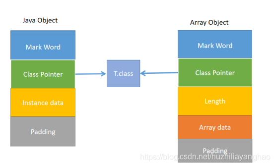
对象头(Object Header):Mark Word 与 Class Pointer(类型指针)。
Mark Word存储了对象的hashCode、GC信息、锁信息三部分，Class Pointer存储了指向类对象信息的指针。
在32位JVM上对象头占用的大小是8字节，64位JVM则是16字节，两种类型的Mark Word 和 Class Pointer各占一半空间大小。
ClassPointer指针:在64位JVM上有一个压缩指针选项-ClassPointer指针：-XX:+UseCompressedClassPointers 为4字节 不开启为8字节。开启之后Class Pointer部分就会压缩为4字节，此时对象头大小就会缩小到12字节。
实例数据(instance data)：
Padding对齐，8的倍数;
##### Q2:new Object()内存中占用多少个字节
16个字节
##### Q3:对象在内存中的定位
1. 句柄访问:
优点：reference种存储稳定句柄地址，对象被移动时只会改变句柄中实例数据指针即可，reference本身不需要修改,**垃圾回收效率较高**
缺点：比较费空间，需要单独开辟一个句柄池。速度相比直接指针可能还要慢一点。
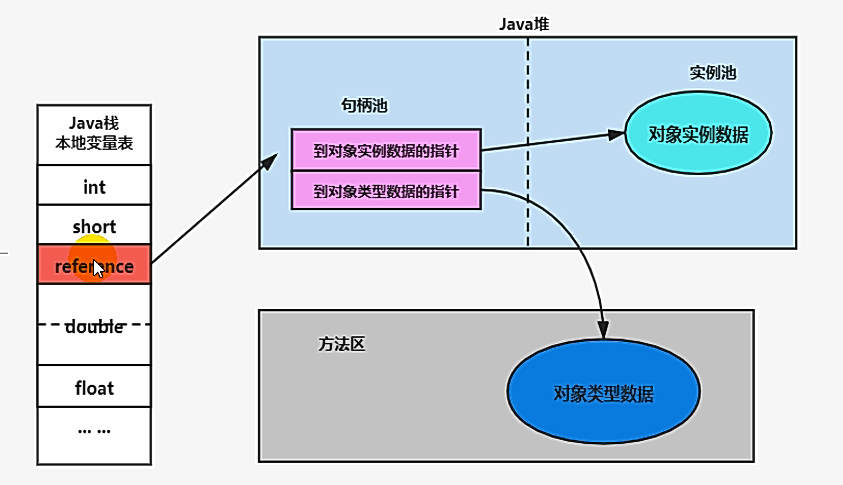
1. 直接指针
优点：访问的速度比句柄池要快。
缺点：对象被移动时，reference本身需要修改。
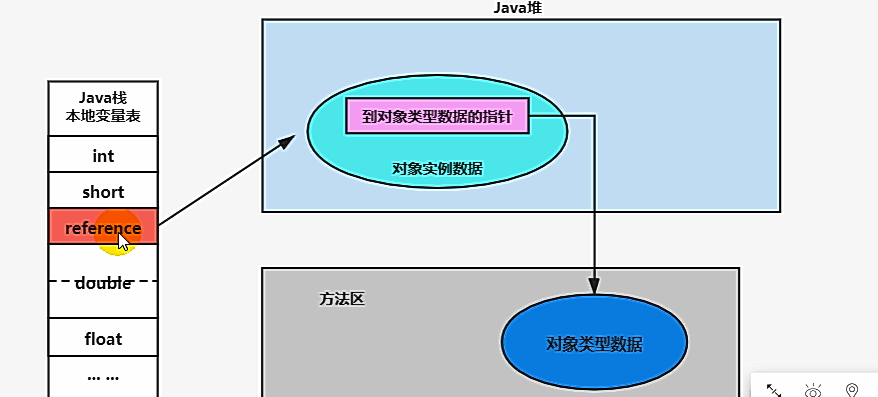
##### Q4:对象怎么分配
首先对象是优先在**栈上分配**，并不是优先在堆上分配，但是他在栈上分配必须满足两个条件。在栈上分配的元素不会经过垃圾回收，而是随着方法的结束，栈桢弹出而结束，大大提高了效率
1. 逃逸分析后没有发生逃逸,即方法执行完之后还被其他地方引用
1. 可以进行标量替换
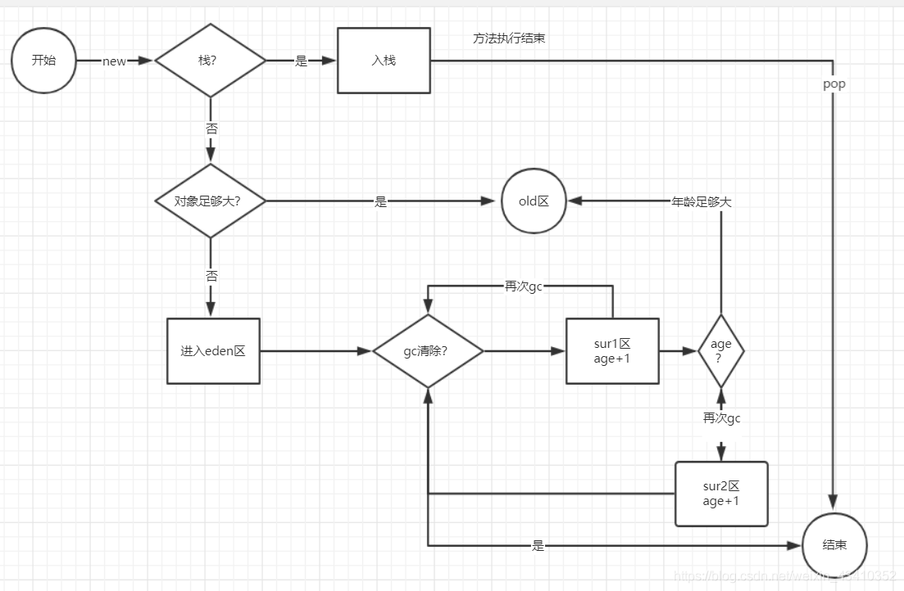
##### Q5:指针碰撞、空闲列表和TALB
指针碰撞:堆内存被一个指针一分为二，指针的左边都被塞满了对象，指针的右变是未使用的区域。每一次有新的对象创建，指针就会向右移动一个对象
适用于堆内存完整的情况，已分配的内存和空闲内存分表在不同的一侧，通过一个指针指向分界点，当需要分配内存时，把指针往空闲的一端移动与对象大小相等的距离即可，用于Serial和ParNew等不会产生内存碎片的垃圾收集器。
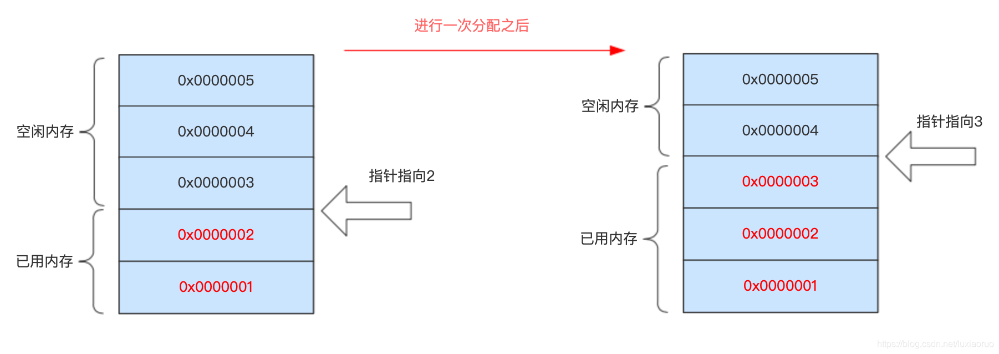
空闲列表:已用区域会随着垃圾收集，出现大量的碎片，造成内存不连续。解决的思路是建立一个FreeList，把释放的区域加入到FreeList中，下次分配对象的时候，优先从 FreeList 中寻找合适的内存大小进行分配
适用于堆内存不完整的情况，已分配的内存和空闲内存相互交错，JVM通过维护一张内存列表记录可用的内存块信息，当分配内存时，从列表中找到一个足够大的内存块分配给对象实例，并更新列表上的记录，最常见的使用此方案的垃圾收集器就是CMS。
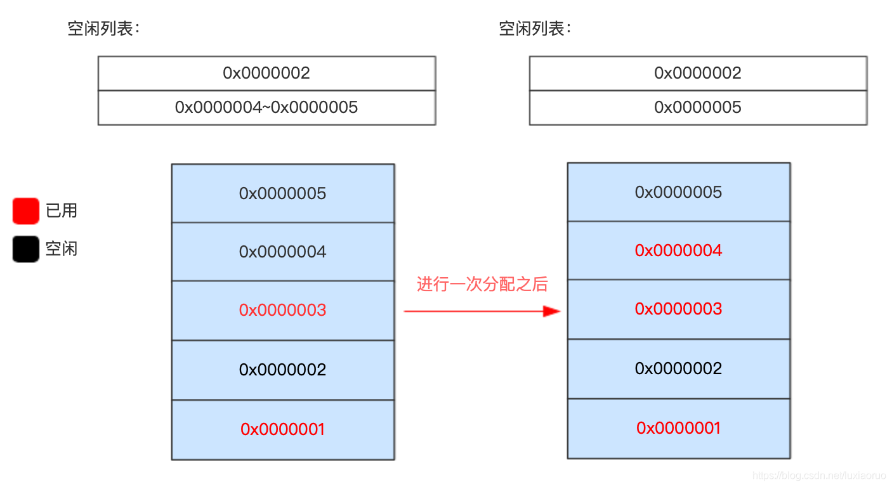
TALB:(Thread Local Allocation Buffer)
在线程启动时，在堆的Eden区域申请一块指定大小的内存，线程私有，如果线程内需要创建对象，则在此区域内创建，避免并发，提升性能。包含start、top（归属线程最后一次申请的尾位置）、end。
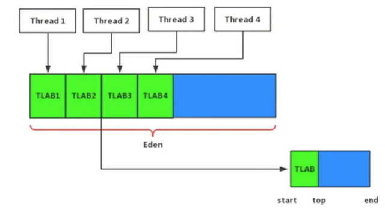
缺点:
1.会造成空间浪费，并造成内存碎片。
2.GC内存分配不稳定，因为不同业务TLAB都是变化的。
所以，一般建议不能一下子就给一个线程申请一个比较大的 TLAB，而是考虑这个线程 TLAB 分配满之后再申请新的，这样更加灵活。
##### Q6:对象的创建过程
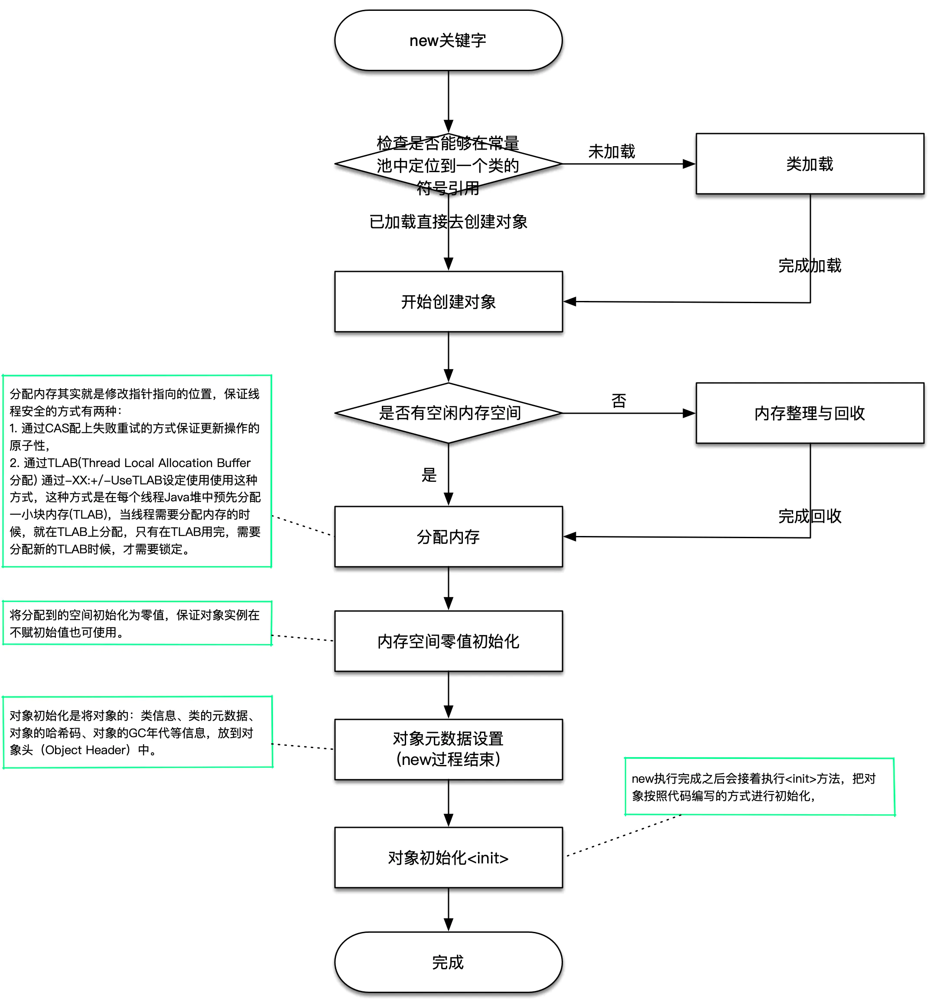
##### Q7:DCL是否需要volatile
DCL:dubble check lock 双重锁检查
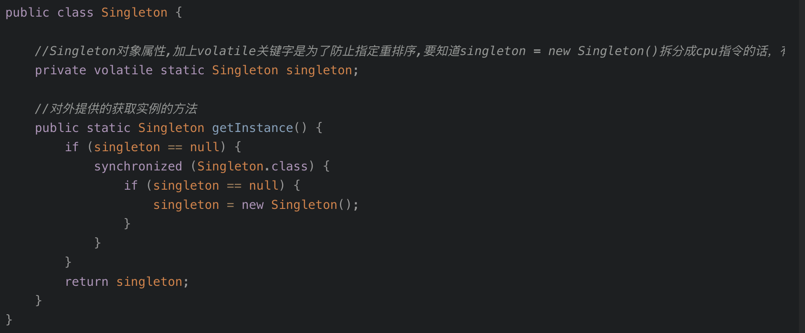
以为对象的创建过程(new关键字),它简单的分为三个阶段:
1.分配对象内存空间.
2.初始化对象.
3.设置对象指向内存空间.
实际上可能锁:
以为对象的创建过程(new关键字),它简单的分为三个阶段:
1.分配对象内存空间.
2.设置对象指向内存空间.
3.初始化对象.
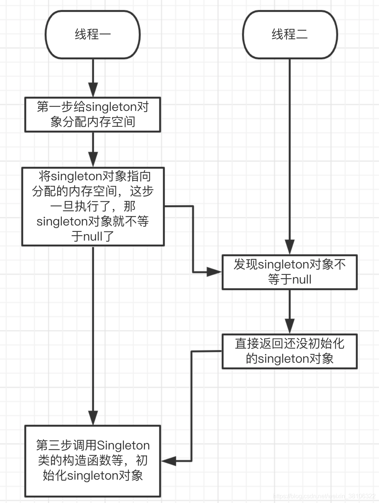
需要;volatile的作用:
1.保证线程之间的可见行
2.防止**指令重排**                
##### Q8:垃圾回收理论
https://cloud.tencent.com/developer/article/1069187
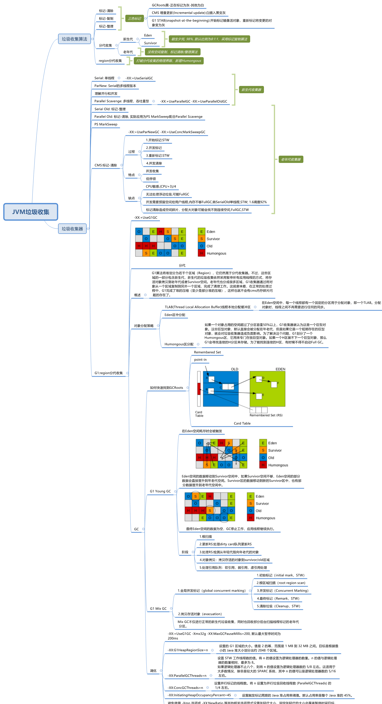
1. 垃圾回收算法
- 标记-清除算法:
首先标记出所有需要回收的对象，在标记完成后统一回收所有被标记的对象;
缺点:
1) 效率问题，标记和清除两个过程的效率都不高；
2) 空间问题，标记清除之后会产生大量不连续的内存碎片
- 复制算法:
将可用内存按容量划分为大小相等的两块，每次只使用其中的一块。当这一块内存用完了，就将还存活着的对象复制到另外一块上，然后再把已经使用过的内存空间一次清理掉。
优点:不用考虑内存碎片等复杂情况，只要移动堆顶指针，按顺序分配内存即可，实现简单，运行高效。
缺点:内存缩小为原来的一半。且对象成活率较高时就要进行较多的复制操作，效率将会变低。
(故更使用于年轻代GC)
- 标记-整理算法:
标记过程仍然和标记-清除一样，但后续步骤不是直接对可回收对象进行清理，而是让所有存活的对象都向一端移动，然后直接清理端边界以外的内存.
(适用于老年代GC)
- 分代收集算法:
当前商业虚拟机的垃圾收集都采用”分代收集“(Generational Collection)算法，这种算法根据对象存活周期的不同将内存划分为几块。
一般把Java堆分为新生代和老年代，这样就可以根据各个年代的特点采用最适当的收集算法。
在新生代，每次垃圾收集时都发现大批对象死去，只有少量存活，那就选用复制算法，只需要付出少量存活对象的复制成本就可以完成收集。
而老年代中因为对象存活率较高，没有额外的空间对它进行分配担保，就必须使用”标记-清理“和”标记-整理“算法来进行回收。
2. 判断对象是否可以被回收的方法
- 引用计数法:引用计数法就是如果一个对象没有被任何引用指向，则可视之为垃圾。这种方法的缺点就是不能检测到环的存在。
- 可达性分析法:”GC Roots”的对象作为起始点，从这些节点开始向下搜索，搜索所走过的路径称为引用链(Reference Chain)，当一个对象到GC Roots没有任何引用链相连时，则证明此对象是不可用的。
GC Roots:
- 虚拟机栈(栈帧中的本地变量表)中引用的对象
- 方法去中类静态属性引用的对象
- 方法区中常量引用的对象
- 本地方法栈中JNI(即一般说的Native方法)引用的对象
3. 垃圾回收器:
- Serial 收集器(标记-复制、新生代)
开启方式:`-XX:+UseSerialGC`
单线程，一个CPU或一条收集线程去完成垃圾收集工作，收集时必须暂停其他所有的工作线程，直到它结束。
虽然如此，它依然是虚拟机运行在Client模式下的默认新生代收集器。简单而高效。
- ParNew 收集器(新生代)
ParNew是Serial收集器的多线程版本。Server模式下默认新生代收集器，除了Serial收集器之外，只有它能与CMS收集器配合工作。
- 并行 Parallel(JDK1.8 老年代默认)
开启方式:`-XX:+UseParallelGC -XX:+UseParallelOldGC`
指多条垃圾收集线程并行工作，但此时用户线程仍然处于等待状态。
- 并发 Concurrent
指用户线程与垃圾收集线程同时执行(但不一定是并行的，可能会交替执行)，用户程序再继续运行，而垃圾收集程序运行于另一个CPU上。
- Parallel Scavenge 收集器(新生代;JDK1.8新声代默认)
Parallel Scavenge 收集器是一个新生代收集器，它也是使用复制算法的收集器。
更加注重吞吐量(吞吐量 = 运行用户代码时间 / (运行用户代码时间+垃圾收集时间))
停顿时间越短就越适合需要与用户交互的程序，良好的响应速度能提升用户体验，而高吞吐量则可以高效地利用CPU时间，主要适合在后台运算而不需要太多交互的任务。
Parallel Scavenge收集器提供了两个参数用于精确控制吞吐量，
分别是控制最大垃圾收集停顿时间`-XX:MaxGCPauseMillis`以及直接设置吞吐量大小的`-XX:GCTimeRatio`。
- CMS(老年代算法,与ParNew搭配使用)
开启方式`-XX:+UseParNewGC -XX:+UseConcMarkSweepGC`
CMS(Concurrent Mark Sweep) 收集器是一种以获取最短回收停顿时间为目标的收集器。目前很大一部分的Java应用集中在互联网站或者B/S系统的服务端上，这类尤其重视服务的响应速度，希望系统停顿时间最短。
CMS基于 标记-清除算法实现。整个过程分为4个步骤：
初始标记(CMS initial mark) -**stop the world**
并发标记(CMS concurrent mark)
重新标记(CMS remark) -**stop the world**
并发清除(CMS concurrent sweep)
初始标记，重新标记这两个步骤仍然需要Stop The World, 初始标记仅仅标记以下GC Roots能直接关联的对象，速度很快。
并发标记就是进行GC Roots Tracing的过程；
而重新标记阶段则是为了修正并发标记期间因为用户程序继续运作而导致标记产生变动的那一部分对象的标记记录。这个阶段停顿比初始标记稍微长，但远比并发标记的时间短。
整个过程耗时最长的并发标记和并发清除过程，收集器都可以与用户线程一起工作。总体上来说，CMS收集器的内存回收过程与用户线程一起并发执行的。
CMS特点：并发收集，低停顿。
缺点:
1. CMS收集器对CPU资源非常敏感。默认启动的回收线程数是(CPU+3)/4. 当CPU 4个以上时，并发回收垃圾收集线程不少于25%的CPU资源。
2. CMS收集器无法处理浮动垃圾(Floating Garbage)
浮动垃圾:由于CMS并发清理时，用户线程还在运行，伴随产生新垃圾，而这一部分出现在标记之后，只能下次GC时再清理。
3. CMS基于”标记-清除“算法实现的，则会产生大量空间碎片，空间碎片过多时，没有连续空间分配给大对象，不得不提前触发一次FUll GC。
三色标记算法:追踪式回收器的一种有用的方法，利用它可以推演回收器的正确性。
黑色:根对象，或者该对象与它的子对象都被扫描
灰色:对象本身被扫描,但还没扫描完该对象中的子对象
白色:未被扫描对象，扫描完成所有对象之后，最终为白色的为不可达对象，即垃圾对象;
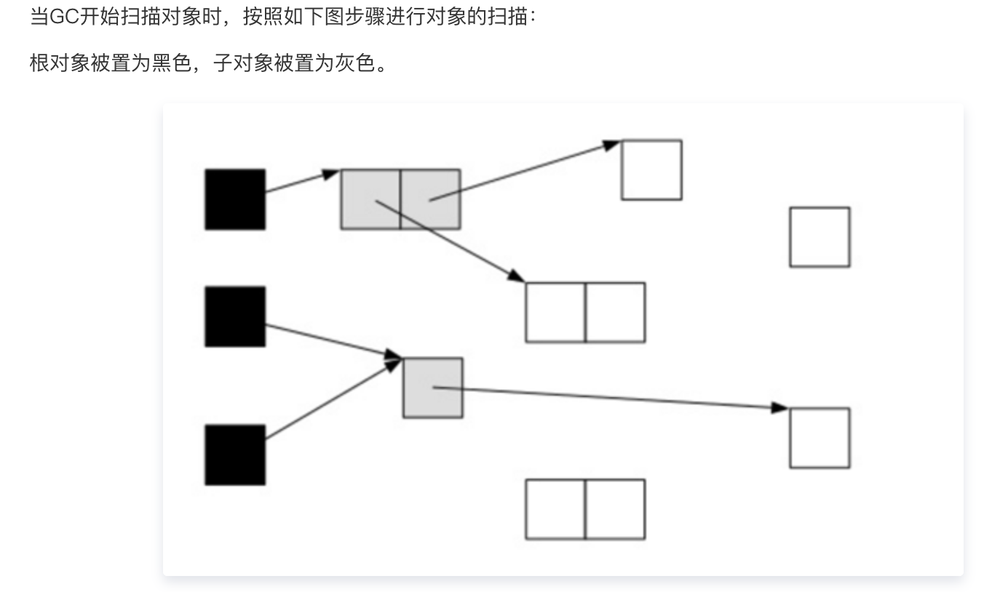
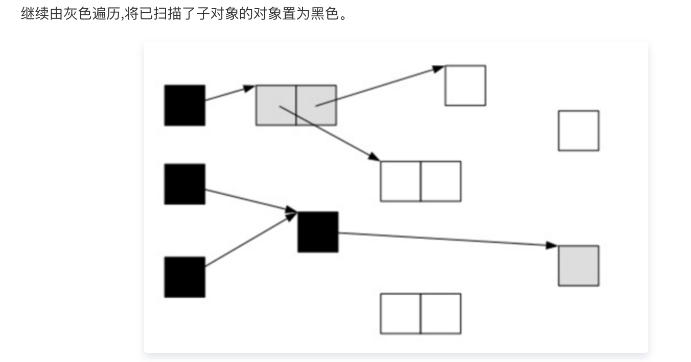
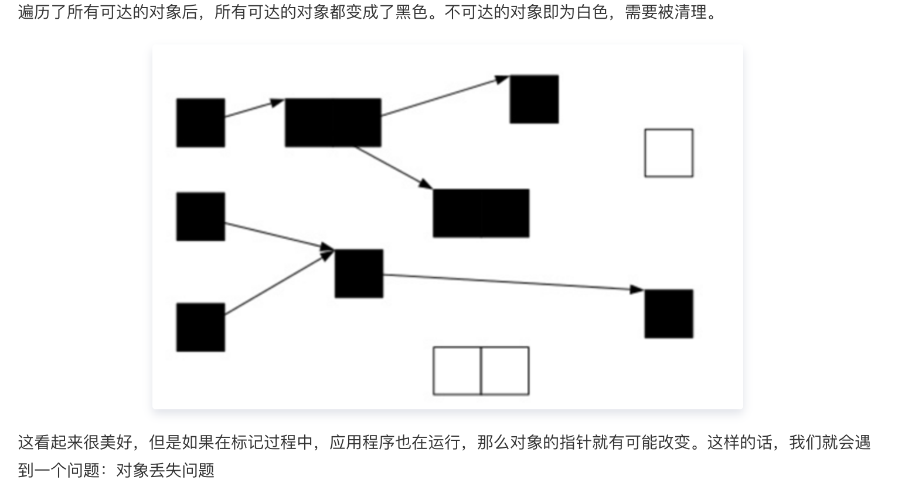
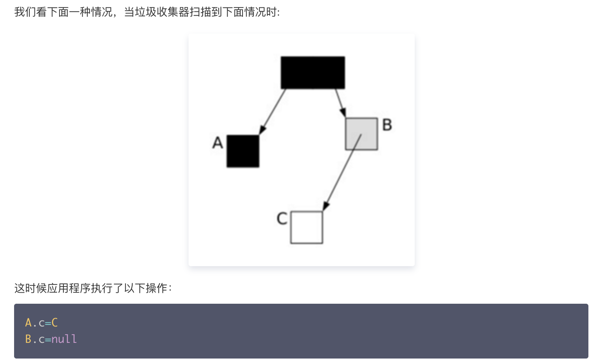
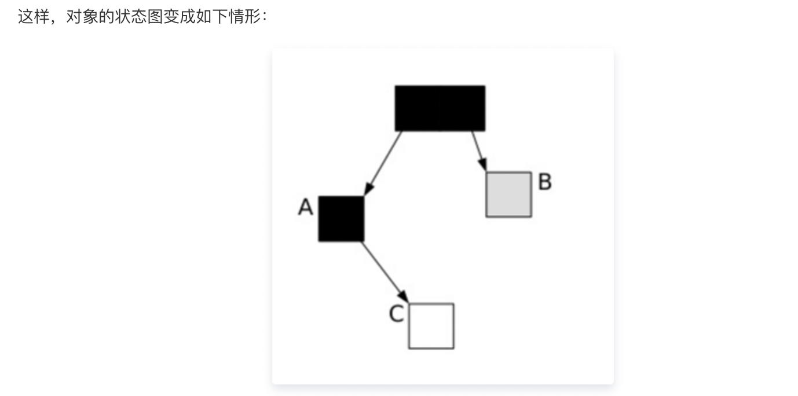
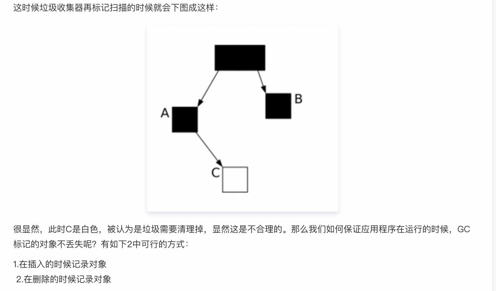
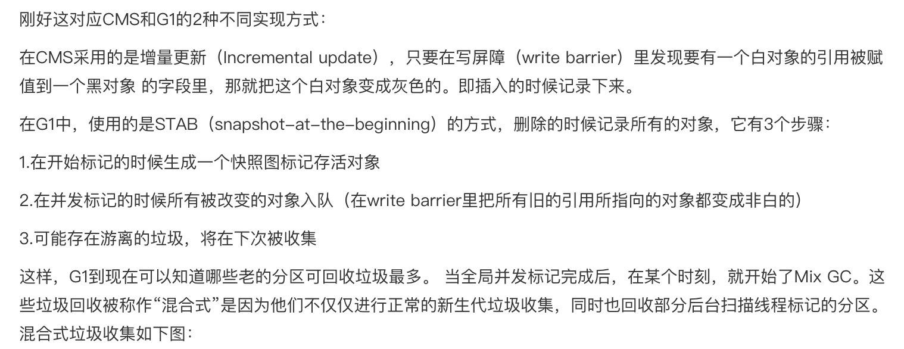
   
三色标记时产生漏标的条件有两个：
1. 黑色对象指向了白色对象
2. 灰色对象指向白色对象的引用消失

要解决漏标问题，打破两个条件之一即可：
1. 跟踪黑指向白的增加 incremental update：增量更新，关注引用的增加，把黑色重新标记为灰色，下次重新扫描属性。CMS采用该方法。
2. 记录灰指向白的消失 SATB snapshot at the beginning：关注引用的删除，当灰-->白消失时，要把这个 引用 推到GC的堆栈，保证白还能被GC扫描到。G1采用该方法。

**为什么G1采用SATB而不用incremental update？**
因为采用incremental update把黑色重新标记为灰色后，之前扫描过的还要再扫描一遍，效率太低。

G1有RSet与SATB相配合。Card Table里记录了RSet，RSet里记录了其他对象指向自己的引用，这样就不需要再扫描其他区域，只要扫描RSet就可以了。

也就是说 灰色-->白色 引用消失时，如果没有 黑色-->白色，引用会被push到堆栈，下次扫描时拿到这个引用，由于有RSet的存在，不需要扫描整个堆去查找指向白色的引用，效率比较高。SATB配合RSet浑然天成。

- G1(JDK1.9默认,年轻代老年代通吃)

https://www.jianshu.com/p/5116a7acb866  
开启方式`-XX:+UseG1GC -XX:MaxGCPauseMillis=200`
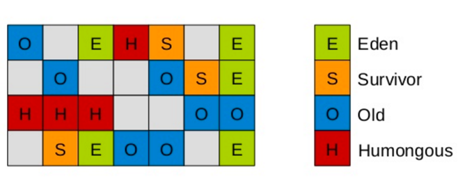
Humongous区域:如果一个对象占用的空间超过了分区容量50%以上，G1收集器就认为这是一个巨型对象。
这些巨型对象，默认直接会被分配在年老代，但是如果它是一个短期存在的巨型对象，就会对垃圾收集器造成负面影响。
为了解决这个问题，G1划分了一个Humongous区，它用来专门存放巨型对象。
物理上分区;逻辑上分代.
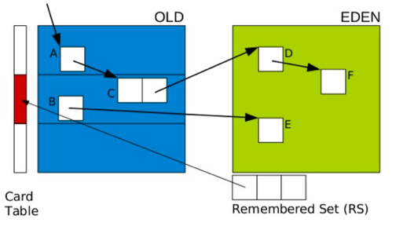
卡表(Card Table):一个Card Table将一个分区在逻辑上划分为固定大小的连续区域，每个区域称之为卡。
卡通常较小，介于128到512字节之间。Card Table通常为字节数组，由Card的索引（即数组下标）来标识每个分区的空间地址。默认情况下，每个卡都未被引用。
当一个地址空间被引用时，这个地址空间对应的数组索引的值被标记为”0″，即标记为脏被引用，此外RSet也将这个数组下标记录下来。
Remembered Set:一般情况下，这个RSet其实是一个Hash Table，Key是别的Region的起始地址，Value是一个集合，里面的元素是Card Table的Index。
两种GC:
- Full young GC
1. 根扫描:静态和本地对象被扫描
2. 更新RS:处理dirty card队列更新RS(排空Dirty Card Queue)
3. 处理RS:检测从年轻代指向年老代的对象
4. 对象拷贝:拷贝存活的对象到survivor/old区域
5. 处理引用队列:软引用，弱引用，虚引用处理
- Mixed GC
1. 全局并发标记（global concurrent marking）
    1. 初始标记（initial mark，STW）
    1. 根区域扫描（root region scan
    1. 并发标记（Concurrent Marking）
    1. 最终标记（Remark，STW）
    1. 清除垃圾（Cleanup，STW）
2. 拷贝存活对象（evacuation）
优点:
1) 追求高吞吐量
2) 追求响应时间,可设置目标
3) 灵活:分区回收;优先回收花费时间少,垃圾比例高的region
##### Q9:jvm调优?工具、指令以及分析方法
`-XX:+HeapDumpOnOutOfMemoryError`参数表示当JVM发生OOM时，自动生成DUMP文件。
jmap(查看内存):输出所有内存中对象的工具
map -histo <pid> 查看占用内存最多的对象
(不推荐,堆内存吃紧)
导出dump文件后通过mat、jvisualvm进行静态分析
jvisualvm可以远程服务器,连接端口动态分析
jstack(查看线程)
Arthas 是Alibaba开源的Java诊断工具
- dashboard：查看jvm\线程\env基本信息（上面浏览器查看效果）
- thread：查看线程的运行状态
- jad：反编译class文件[通过自动补全，查找上线代码是否包含自己新增的功能，很方便]
- sc：查看jvm中已经加载的类信息
- stack：调用栈信息
- Track：观察方法执行的时候哪个子调用比较慢:
- watch：观察方法的执行入参
- redefine:热替换

