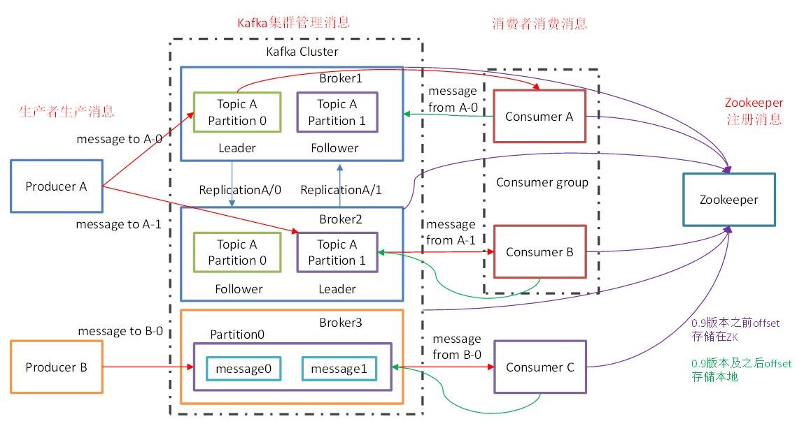
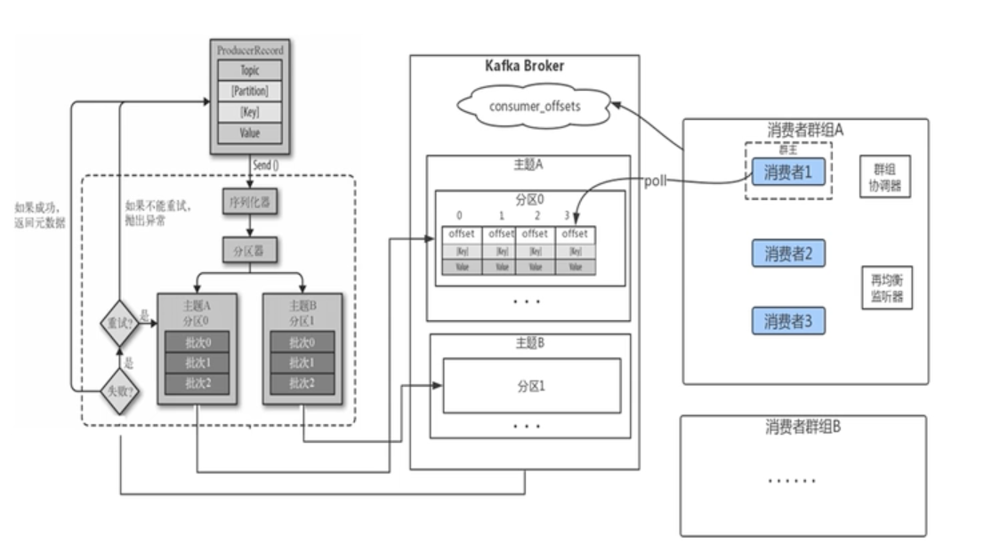
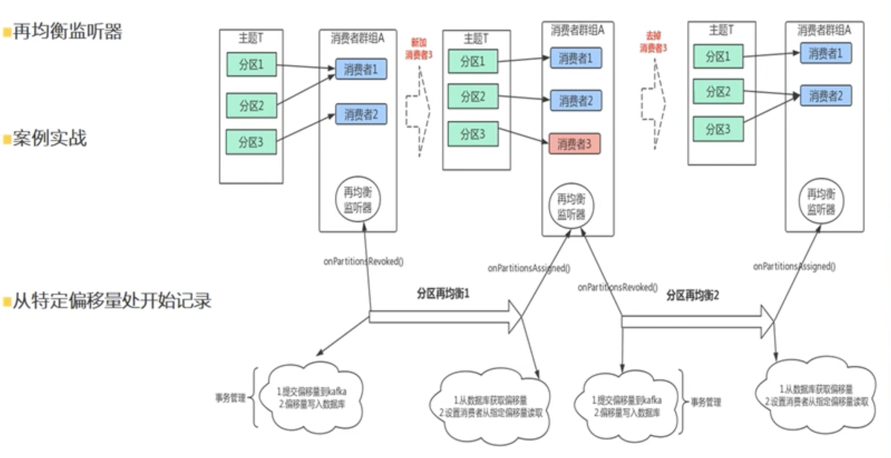
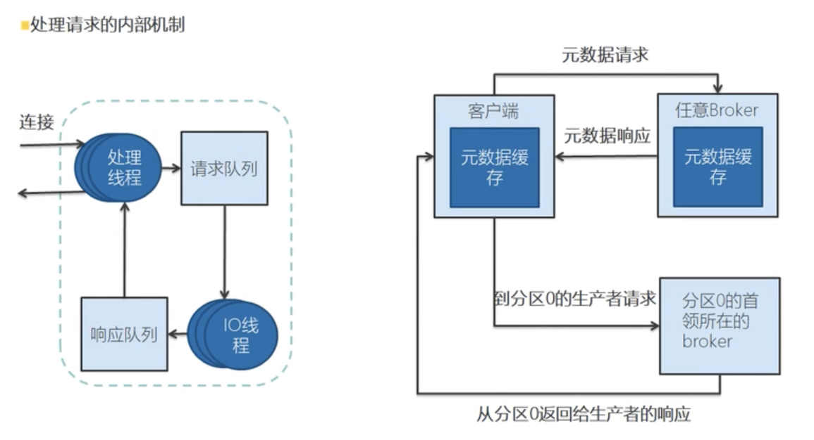
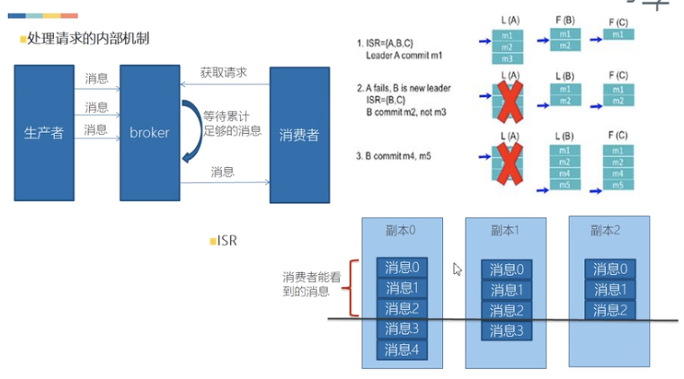
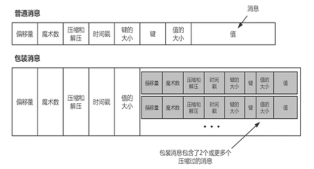
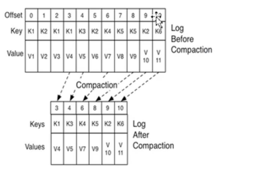
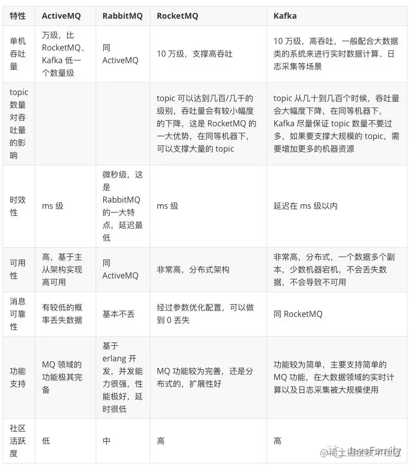
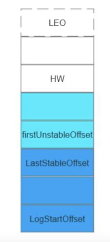
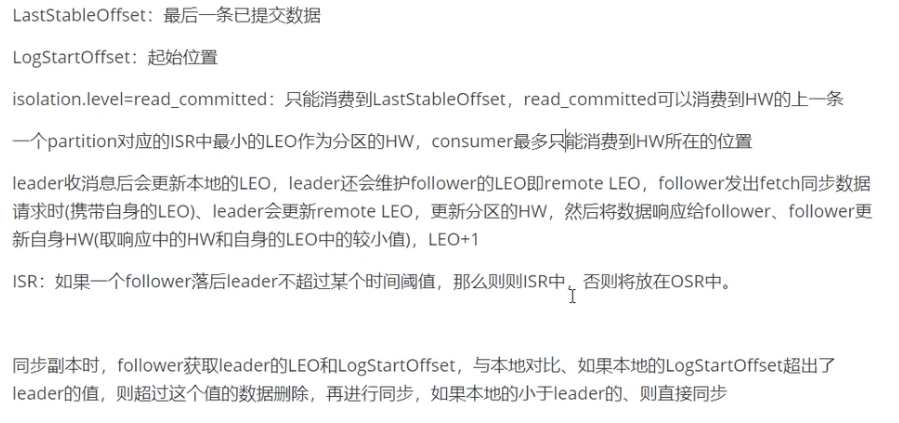

# 消息队列
##### Q0:kafka基础知识
https://cnblogs.com/clawhub/p/11973407.html

1. Producer
消息生产者，将消息push到Kafka集群中的Broker。
2. Consumer
消息消费者，从Kafka集群中pull消息，消费消息。
3. Consumer Group
消费者组，由一到多个Consumer组成，每个Consumer都属于一个Consumer Group。消费者组在逻辑上是一个订阅者。
消费者组内每个消费者负责消费不同分区的数据，一个分区只能由一个组内消费者消费；消费者组之间互不影响。
即每条消息只能被Consumer Group中的一个Consumer消费；但是可以被多个Consumer Group组消费。这样就实现了单播和多播。
4. Broker
一台Kafka服务器就是一个Broker,一个集群由多个Broker组成，每个Broker可以容纳多个Topic.
5. Topic
消息的类别或者主题，逻辑上可以理解为队列。Producer只关注push消息到哪个Topic,Consumer只关注订阅了哪个Topic。
6. Partition
负载均衡与扩展性考虑，一个Topic可以分为多个Partition,物理存储在Kafka集群中的多个Broker上。可靠性上考虑，每个Partition都会有备份Replica。
7. Replica
Partition的副本，为了保证集群中的某个节点发生故障时，该节点上的Partition数据不会丢失，且Kafka仍能继续工作，所以Kafka提供了副本机制，一个Topic的每个Partition都有若干个副本，一个Leader和若干个Follower。
8. Leader
Replica的主角色，Producer与Consumer只跟Leader交互。
9. Follower
Replica的从角色，实时从Leader中同步数据，保持和Leader数据的同步。Leader发生故障时，某个Follower会变成新的Leader。
10. Controller
Kafka集群中的其中一台服务器，用来进行Leader election以及各种Failover（故障转移）。
11. ZooKeeper
Kafka通过Zookeeper存储集群的meta等信息。
**kakfa 工作流程**
    
**再均衡监听器**
    
**处理请求的内部机制**
    
    

AR(Assigned Repllicas):分区中的所有副本 AR=ISR+OSR
    
OSR(Out-Sync Relipcas):与leader副本同步滞后过多的副本（不包括leader）副本

ISR(in-sync replica):是Leader在Zookeeper（/brokers/topics/[topic]/partitions/[partition]/state）目录中动态维护基本保持同步的Replica列表，

该列表中保存的是与Leader副本保持消息同步的所有副本对应的节点id。

LEO（last end offset）日志末端偏移量，记录了该副本对象底层日志文件中下一条消息的位移值。

HW（highwatermark），高水印值，任何一个副本对象的HW值一定不大于其LEO值，而小于或等于HW值的所有消息被认为是“已提交的”或“已备份的”。consumer只能消费已提交的消息，HW之后的数据对consumer不可见。

LW(Low Watermark):低水位,代表AR集合中最小的logStartOffset.

LSO(LastStableOffset):与kafka的事物相关,最后一条事物未已经交的数据
消费端参数——isolation.level,这个参数用来配置消费者事务的隔离级别。字符串类型，“read_uncommitted”和“read_committed”，表示消费者所消费到的位置，如果设置为“read_committed"，那么消费这就会忽略事务未提交的消息，既只能消费到LSO(LastStableOffset)的位置，默认情况下，”read_uncommitted",既可以消费到HW（High Watermak）的位置。
注：follower副本的事务隔离级别也为“read_uncommitted"，并且不可修改。
lag的计算公式:
read_uncommitted:Lag = HW - ConsumerOffset
read_committed:LSO - ConsumerOffset

同步过程:
Follower向Leader发送fetch请求（此过程类似于普通Customer，区别在于内部broker的读取请求，没有HW的限制）。
Leader接收到Follwer fetch操作后根据fetch请求中Postion从自身log中获取相应数据，并根据fetch请求中Postion更新leader中存储的follower LEO。通过follower LEO读取存在于ISR列表中副本的LEO（包括leader自己的LEO）值，并选择最小的LEO值作为HW值。
Follower接收到leader的数据响应后，开始向底层log写数据，每当新写入一条消息，其LEO值就会加1，写完数据后，通过比较当前LEO值与FETCH响应中leader的HW值，取两者的小者作为新的HW值。
由此可见，Kafka复制机制既不是完全的同步复制，也不是单纯的异步复制，Kafka通过 ISR复制机制在保障数据一致性情况下又可提供高吞吐量。
数据保障一致性的方法:
`request.required.acks`：该参数在producer向leader发送数据时设置。
- 0:producer无需等待来自broker的确认而继续发送下一批消息。这种情况下数据传输效率最高，但是数据可靠性确是最低的。
- 1(默认):producer在ISR中的leader已成功收到数据并得到确认。如果leader宕机了，则会丢失数据。
- -1/all:producer需要等待ISR中的所有follower都确认接收到数据后才算一次发送完成，可靠性最高。但是这样也不能保证数据不丢失，比如当ISR中只剩下一个leader时，这样就变成了acks=1的情况。
  `min.insync.replicas`：该参数在broker或者topic层面进行设置，设定ISR中的最小副本数是多少，默认值为1，当且仅当request.required.acks参数设置为-1时，此参数才生效。如果ISR中的副本数少于min.insync.replicas配置的数量时，客户端会返回异常：org.apache.kafka.common.errors.NotEnoughReplicasExceptoin: Messages are rejected since there are fewer in-sync replicas than required。
  `unclean.leader.election.enable：
- true :默认值，所有replica都有成为leader的可能。
- false:只有在ISR中存在的replica才有成为leader的可能。
  要保证数据写入到Kafka是安全的，高可靠的，需要如下的配置：
  topic的配置：replication.factor>=3,即副本数至少是3个；2<=min.insync.replicas(最小同步副本)<=replication.factor
  broker的配置：leader的选举条件unclean.leader.election.enable=false(不允许不完全选举)
  producer的配置：request.required.acks=-1(all)，producer.type=sync
  **物理存储机制**
  
  **超时数据清理**
  
  **可靠系统的消费者(不重复、不丢失)**
  提交偏移量(自动<时间间隔>、手动)
  再均衡监听器(发生了分区再均衡的时候,通过额外的机制,事物、统一存储)
  幂等性
##### Q1:kafka网络模型
https://www.jianshu.com/p/a6b9e5342878
##### Q1:几种常见的消息队列对比

##### Q2:kafka高性能高吞吐量的原因
1. 磁盘顺序读写,kafka消息都是append操作,partition是有序的,节省了磁盘寻道时间.
1. 零拷贝:避免CPU将数据从一块存储拷贝到另一块存储的技术
    - 传统的数据复制
    1. 读取磁盘文件数据到内核缓冲区
    1. 将内核缓冲区的数据copy到用户缓冲区
    1. 将用户缓冲区的数据copy到socket的发送缓冲区
    1. 将socket发送缓冲区中的数据到网卡,进行传输
    - 零拷贝:磁盘文件->内核空间读取缓冲区->网卡接口->消费者进程
1. 分区分段+索引
    1. 消息实际上市分布式存储在一个一小的segment中,每个文件操作也是直接操作的segment.
    1. 为了进一步的查询优化,kafka又默认为分段后的数据创建了索引文件(.index文件).提高了读取效率以及处理的并行度.
1. 批量压缩
1. 批量读写
1. 直接操作page cache;而不是jvm,避免GC耗时以及对象创建耗时,且读写速度更快,进程重启缓存也不会丢失.
##### Q3:kafka消息丢失以及解决方案
消息发送:
要保证数据写入到Kafka是安全的，高可靠的，需要如下的配置：
topic的配置：replication.factor>=3,即副本数至少是3个；2<=min.insync.replicas(最小同步副本,保证有同步的节点存在)<=replication.factor
broker的配置：leader的选举条件unclean.leader.election.enable=false(不允许不完全选举,禁止选举OSR的follower),等待从节点同步完成之后再选举
producer的配置：request.required.acks=-1(all)，producer.type=sync
消费:
提交偏移量(自动<时间间隔>、手动(使用))
再均衡监听器(发生了分区再均衡的时候,通过额外的机制,事物、统一存储)
幂等性
broker的刷盘:减小刷盘间隔
##### Q4:kafka的pull和push分别有什么优缺点
1.pull表示消费者主动拉取,由消费者自己控制,量力而行.
2.push表示broker主动推送消息,即时性高,但是可能造成消息堆积,
##### Q5:kafka为什么比RocketMq吞吐量高
kafka的生产者采用异步发送消息机制,当发送一条消息时,消息并没有发送到broker而是缓存起来;然后直接向
业务返回成功,当缓存的消息达到一定数量时再批量发送到broker.这种做法减少了网络IO,从而提高了消息发送的吞吐量,
但是如果消息生产者宕机,会导致消息丢失,业务出错,所以理论上利用此机制提高了性能但是降低了可靠性
##### Q7:kafka中zk的作用(老版本下)
/brokers/ids 临时节点,保存所有的broker节点信息,存储broker的物理地址、版本信息、启动时间等
节点名称为brokerID,broker定时发送心跳到zk,如果断开则该brokerID删除
/broksers/topics 临时节点,节点保存broker节点下的所有topic信息,每一个topic节点下包含一个
固定的partitons节点,partitons的子节点就说topic的分区,每个分区下保存一个state节点、保存
当前leader分区和ISR的brokerID,state节点由leader创建,若leader宕机则该节点会被删除,重新选举
生成新的state节点
/consumer/[group_id]/owners/[tipic]/[broker_id-partition_id]:维护消费者和分区的注册关系
/consumer/[group_id]/offsets/[tipic]/[broker_id-partition_id]:分区消息的消费进度Offset
##### Q8:简述kafka rebalance机制
https://zhuanlan.zhihu.com/p/98770059?from_voters_page=true
##### Q9:简述kafka 副本同步机制

##### Q10:简述kafka 架构设计
https://www.cnblogs.com/clawhub/p/11973407.html
