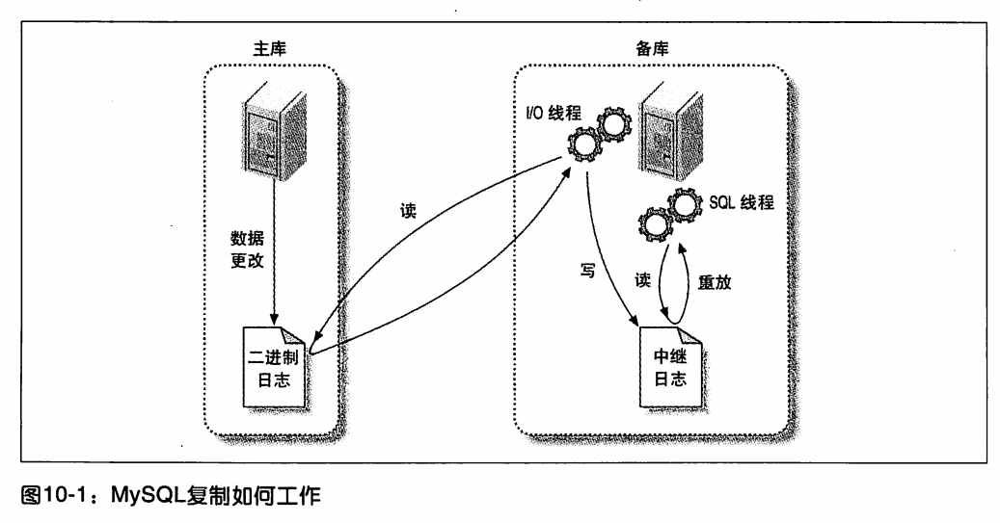
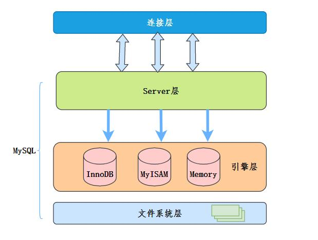
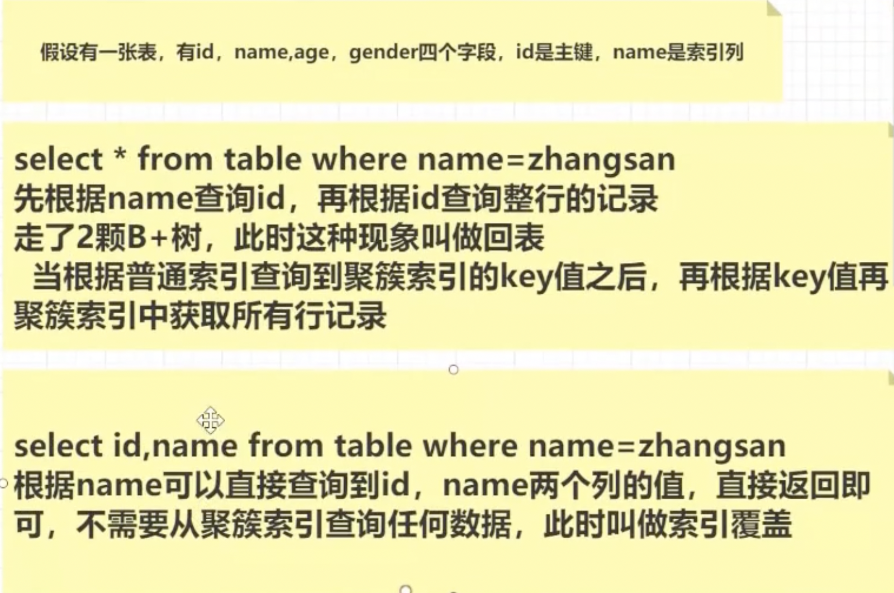
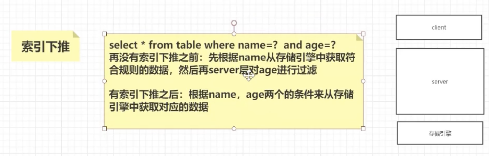
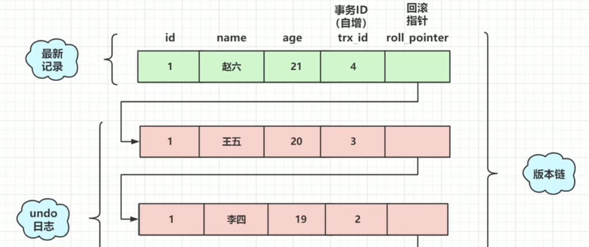
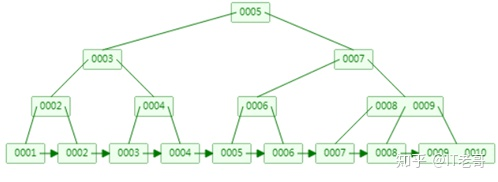
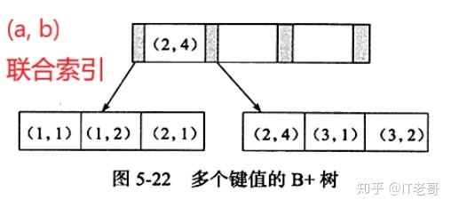

# mysql
##### Q0 数据库事物隔离级别
数据库事务的隔离级别有4种，由低到高分别为Read uncommitted 、Read committed(**大部分数据库的默认隔离级别**) 、Repeatable read (**mysql默认**)、Serializable 。而且，在事务的并发操作中可能会出现脏读，不可重复读，幻读。
**Read uncommitted**:读未提交，顾名思义，就是一个事务可以读取另一个未提交事务的数据。
**Read committed**:读提交，顾名思义，就是一个事务要等另一个事务提交后才能读取数据。
**Repeatable read**:重复读，就是在开始读取数据（事务开启）时，不再允许修改操作
　　那为什么“读提交”同“读未提交”一样，都没有查询加锁，但是却能够避免脏读呢？
这就要说道另一个机制“快照（snapshot）”，而这种既能保证一致性又不加锁的读也被称为“快照读（Snapshot Read）”
　　假设没有“快照读”，那么当一个更新的事务没有提交时，另一个对更新数据进行查询的事务会因为无法查询而被阻塞（因为上了X锁，即写锁，所以不能得到S锁，即读锁），这种情况下，并发能力就相当的差。而“快照读”就可以完成高并发的查询，不过，“读提交”只能避免“脏读”，并不能避免“不可重复读”和“幻读”。
**Serializable 序列化**:Serializable 是最高的事务隔离级别，在该级别下，事务串行化顺序执行，可以避免脏读、不可重复读与幻读。但是这种事务隔离级别效率低下，比较耗数据库性能，一般不使用。
**脏读**：指当一个事务正在访问数据，并且对数据进行了修改，而这种数据还没有提交到数据库中，这时，另外一个事务也访问这个数据，然后使用了这个数据。因为这个数据还没有提交那么另外一个事务读取到的这个数据我们称之为脏数据。依据脏数据所做的操作肯能是不正确的。
**不可重复读**：指在一个事务内，多次读同一数据。在这个事务还没有执行结束，另外一个事务也访问该同一数据，那么在第一个事务中的两次读取数据之间，由于第二个事务的修改第一个事务两次读到的数据可能是不一样的，这样就发生了在一个事物内两次连续读到的数据是不一样的，这种情况被称为是不可重复读。
在这个级别下，普通的查询同样是使用的“快照读”，但是，和“读提交”不同的是，当事务启动时，就不允许进行“修改操作（Update）”了，而“不可重复读”恰恰是因为两次读取之间进行了数据的修改，因此，“可重复读”能够有效的避免“不可重复读”，但却避免不了“幻读”，因为幻读是由于“插入或者删除操作（Insert or Delete）”而产生的。
**幻象读**：一个事务先后读取一个范围的记录，但两次读取的纪录数不同，我们称之为幻象读（两次执行同一条 select 语句会出现不同的结果，第二次读会增加一数据行，并没有说这两次执行是在同一个事务中）
##### Q1 mysql复制原理

（1）master服务器将数据的改变记录二进制binlog日志，当master上的数据发生改变时，则将其改变写入二进制日志中；
（2）slave服务器会在一定时间间隔内对master二进制日志进行探测其是否发生改变，如果发生改变，则开始一个I/OThread请求master二进制事件
（3）同时主节点为每个I/O线程启动一个dump线程，用于向其发送二进制事件，并保存至从节点本地的中继日志中，从节点将启动SQL线程从中继日志中读取二进制日志，在本地重放，使得其数据和主节点的保持一致，最后I/OThread和SQLThread将进入睡眠状态，等待下一次被唤醒。
##### Q2 Mysql聚簇索引和非聚簇索引的区别
1) 聚簇索引(与数据放在一起的): 
表数据按照索引的顺序来存储的，也就是说索引项的顺序与表中记录的物理顺序一致。对于聚集索引，叶子结点即存储了真实的数据行，不再有另外单独的数据页。 在一张表上最多只能创建一个聚集索引，因为真实数据的物理顺序只能有一种。
2) 非簇集索引: 
表数据存储顺序与索引顺序无关。对于非聚集索引，叶结点包含索引字段值及指向数据页数据行的逻辑指针，其行数量与数据表行数据量一致。

##### Q3 Mysql存储引擎
**InnoDB**:
InnoDB是默认的数据库存储引擎，他的主要特点有：
（1）可以通过自动增长列，方法是auto_increment。
（2）支持事务。默认的事务隔离级别为可重复度，通过MVCC（并发版本控制）来实现的。
（3）使用的锁粒度为行级锁，可以支持更高的并发；
（4）支持外键约束；外键约束其实降低了表的查询速度，但是增加了表之间的耦合度。
（5）配合一些热备工具可以支持在线热备份；
（6）在InnoDB中存在着缓冲管理，通过缓冲池，将索引和数据全部缓存起来，加快查询的速度；
（7）对于InnoDB类型的表，其数据的物理组织形式是**聚簇表**。所有的数据按照主键来组织。数据和索引放在一块，都位于B+数的叶子节点上；
当然InnoDB的存储表和索引也有下面两种形式：
（1）使用共享表空间存储：所有的表和索引存放在同一个表空间中。
（2）使用多表空间存储：表结构放在frm文件，数据和索引放在IBD文件中。分区表的话，每个分区对应单独的IBD文件，分区表的定义可以查看我的其他文章。使用分区表的好处在于提升查询效率。
对于InnoDB来说，最大的特点在于支持事务。但是这是以损失效率来换取的。
**MEMORY**:
将
数据存在内存，为了提高数据的访问速度，每一个表实际上和一个磁盘文件关联。文件是frm。
（1）支持的数据类型有限制，比如：不支持TEXT和BLOB类型，对于字符串类型的数据，只支持固定长度的行，VARCHAR会被自动存储为CHAR类型；
（2）支持的锁粒度为表级锁。所以，在访问量比较大时，表级锁会成为MEMORY存储引擎的瓶颈；
（3）由于数据是存放在内存中，一旦服务器出现故障，数据都会丢失；
（4）查询的时候，如果有用到临时表，而且临时表中有BLOB，TEXT类型的字段，那么这个临时表就会转化为MyISAM类型的表，性能会急剧降低；
（5）默认使用**hash**索引。
（6）如果一个内部表很大，会转化为磁盘表。
**MyISAM**:
使用这个存储引擎，每个MyISAM在磁盘上存储成三个文件。
（1）frm文件：存储表的定义数据
（2）MYD文件：存放表具体记录的数据
（3）MYI文件：存储索引
frm和MYI可以存放在不同的目录下。MYI文件用来存储索引，但仅保存记录所在页的指针，索引的结构是B+树结构。
(4)不支持**事物、外键**
##### Q4 Mysql索引类型
https://zhuanlan.zhihu.com/p/113917726
索引最终选择B+树的原因:
1. hash很快，但每次IO只能取一个数
2. 红黑树存在右倾风险 
3. AVL树，在大量数据的情况下，IO操作还是太多(有多少层就有多少次IO)
4. B树每个节点内存储的是数据，因此每个节点存储的分支太少
5. B+节点存储的是索引+指针(引用指向下一个节点)，可以存储大量索引，同时最终数据存储在叶子节点，并且有引用横向链接，可以在2-3次的IO操作内完成千万级别的表操作。
6. 建议索引是是自增长数字，这样适合范围查找
##### Q5 Mysql锁的类型
基于锁的属性分类:排他锁、互斥锁
基于锁的粒度分类:行级锁(innodb),表级锁(innodb、myisam),页级锁(innodb),记录锁,间隙锁,临键锁
行级锁:update ...
表级锁:update ... where  a = 1 or a = 2;
间隙锁:防止幻读加的锁,加在不存在的空闲空间,可以是两个索引记录之间.
##### 回表、索引覆盖、索引下推的概念
主键索引(聚簇索引)、非主键索引的数据结构都是B+ Tree,唯一区别在于叶子结点中存储的内容不同
主键索引的叶子结点存储的是一行完整的数据
非主键索引的叶子结点存储的则是主键值
- 回表:当使用非主键索引来查询时,第一次搜索拿到主键值之后再通过主键索引搜索B+Tree的过程就叫做回表.
- 索引覆盖:只需要在一棵树上获取SQL所需的所有列数据,无需回表就是索引覆盖
- 索引下推的概念:将上层(服务层)负责的事情,交给下层(引擎层)去处理
好处:减少回表的次数,减少IO操作

https://baijiahao.baidu.com/s?id=1716515482593299829&wfr=spider&for=pc

!Img](../img/mysql/b2a27913.png)

##### Q6 mysql的ACID是如何保障的
https://www.cnblogs.com/kismetv/p/10331633.html
- 原子性:
是指事物是一个最小的单元,要么全部成功,要么全部失败
Undo log(回滚日志):记录下事务中的相关信息,回滚的时候做相反的操作.
- 隔离性:
写写操作:锁机制
写-读操作:MVCC(包含数据的隐藏列、基于undo log的版本链、ReadView)
- 持久性
保证事务提交之后不会因为宕机等原因造成数据丢失;主要基于redo log实现
InnoDB提供了缓存Buffer Pool;读取数据时优先从Buffer Pool中读取,如果没有
则从磁盘读取后放入Buffer Pool;当修改Buffer Pool中的数据时,会调用同步接口对
redo log进行刷盘.如果MySql宕机,可以从redo log中进行恢复.
- 一致性:
一致性是指事务执行结束后，数据库的完整性约束没有被破坏，事务执行的前后都是合法的数据状态。
保证原子性、持久性和隔离性，如果这些特性无法保证，事务的一致性也无法保证
数据库本身提供保障，例如不允许向整形列插入字符串值、字符串长度不能超过列的限制等
应用层面进行保障，例如如果转账操作只扣除转账者的余额，而没有增加接收者的余额，无论数据库实现的多么完美，也无法保证状态的一致
##### Q7 什么是MVCC以及数据库的事务如何实现
MVCC(Multi Version Concurrency Control的简称)，代表**多版本并发控制**。读写不冲突并发性能高.
MVCC最大的优势：读不加锁，读写不冲突。在读多写少的OLTP应用中，读写不冲突是非常重要的，极大的增加了系统的并发性能
MCCC的实现原理

1. 隐藏列:InnoDB中每行数据都有隐藏列，隐藏列中包含了本行数据的**事务id**、**指向undo log的指针**等。
1. 基于undo log的版本链:前面说到每行数据的隐藏列中包含了指向undo log的指针，而每条undo log也会指向更早版本的undo log，从而形成一条版本链。
1. ReadView:是指事务（记做事务A）在某一时刻给整个事务系统（trx_sys）打快照，之后再进行读操作时，会将读取到的数据中的事务id与trx_sys快照比较，从而判断数据对该ReadView是否可见，即对事务A是否可见。
trx_sys中的主要内容，以及判断可见性的方法如下：
low_limit_id：表示生成ReadView时系统中应该分配给下一个事务的id。如果数据的事务id大于等于low_limit_id，则对该ReadView不可见。
up_limit_id：表示生成ReadView时当前系统中活跃的读写事务中最小的事务id。如果数据的事务id小于up_limit_id，则对该ReadView可见。
rw_trx_ids：表示生成ReadView时当前系统中活跃的读写事务的事务id列表。如果数据的事务id在low_limit_id和up_limit_id之间，则需要判断事务id是否在rw_trx_ids中：如果在，说明生成ReadView时事务仍在活跃中，因此数据对ReadView不可见；如果不在，说明生成ReadView时事务已经提交了，因此数据对ReadView可见。
##### Q8 联合索引失效的原理
https://www.zhihu.com/question/421944348/answer/1482401403
单值索引的B+数结构

联合索引的B+数结构

联合索引的键值是大于1个的,且第一个字段是有序的;在第一个字段相等的情况下,第二个字段是有序的,以此类推第三个、第四个字段
在有序的情况下 可以使用二分查找发找到数据;而无序时无法使用到索引来进行查询
##### Q9 数据库查询调优
1) 硬件和操作系统层面的优化
    1. cpu,可用内存大小,网络带宽,磁盘类型,通常由DBA或者运维工程师来完成,按照需求合理配置
1) 架构设计层面的优化
    1. 搭建主从集群,保证高可用
    1. 读写分离
    1. 分库分表
    1. 热点数据使用内存换成
1) Mysql程序配置优化
    1. my.cnf修改配置来;连接数,buffer pool大小,bin log日志是否开启
1) Sql执行优化:慢查询分析,执行计划分析,锁等待情况
    1. sql的查询要一定要基于索引来进行数据扫描
    1. 避免索引列上使用函数或者运算符,导致索引失效
    1. like查询时,将%放在右侧
    1. 使用索引扫描,联合索引的列从左往右,命中越多越好
    1. 尽可能的使用SQL语句用到的索引完成排序;避免使用文件排序的方式
    1. 查询有效的列信息几即可,少用*代替列信息
    1. 永远用小的结果驱动大的结果集
    1. 尽量使用索引覆盖;减少IO次数
##### Q10 分库分表