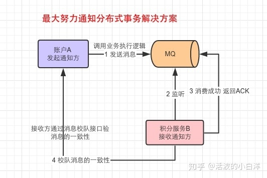

# 分布式
### 分布式id生成方案
|  方案  | 优点  |缺点|
|  ----  | ----  |----  |
| UUUID  | 1.降低全局节点压力,更快生成主键. |UUID占用16个字符,占用空间多;数据写入IO随机性大,索引效率下降 |
| 数据库自增  | IO连续性好,查询速度快 |并发性能不高;分表分库需要改造,复杂;自增,数据和数据量泄露 |
| Redis自增  | Redis计算器,原子性自增,使用内存,并发性能好 |数据丢失;自增,数据量泄露 |
| 雪花算法  | 性能好 |时钟回拨 |
雪花算法生成的ID有哪些部分组成?

1. 符号位,占用1位
1. 时间戳,占用41位,支持69年的时间跨度
1. 机器ID,占用10位
1. 序列号,占用12位.
winshare的分布式ID生成策略

### 分布式锁的解决方案
1. 基于redis的分布式锁
首先 Redis 是单线程的，这里的单线程指的是网络请求模块使用了一个线程（所以不需考虑并发安全性），即一个线程处理所有网络请求，其他模块仍用了多个线程。 
加锁 setnx key value nx ex 10s 
释放锁 delete key 
如果服务A执行还未结束,锁过期,需要续期,watch dog 
A执行完毕,删除锁时需要判断持有的value与redis中的value是否一致,防止释放掉其他服务的锁 
redisson 
1. 基于zookeeper的分布式锁
zookeeper有一个监听机制，客户端注册监听它关心的目录节点，当目录节点发生变化（数据改变、被删除、子目录节点增加删除）等，zookeeper会通知客户端。 
临时节点,顺序节点 
持久性节点表示只要你创建了这个节点，那不管你 ZooKeeper 的客户端是否断开连接，ZooKeeper 的服务端都会记录这个节点。 
临时性节点刚好相反，一旦你 ZooKeeper 客户端断开了连接，那 ZooKeeper 服务端就不再保存这个节点。 
顺便也说下顺序性节点，顺序性节点是指，在创建节点的时候，ZooKeeper 会自动给节点编号比如 0000001，0000002 这种的。 

1. 基于数据库的分布式锁
利用主键或者唯一索引的唯一性
### 分布式系统的幂等的解决方案
1. 查询操作
1. 删除操作
1. 唯一索引
1. token机制
1. traceId
### 分布式架构下,session共享方案
1. 不要session
1. 存入cookie中
1. session同步
1. session存入redis中
1. 使用nginx中的ip绑定策略
winshare的解决方案,将用户登陆信息进行加密生成唯一key,存放于cookie中
并将该key作为redis缓存的key存于redis中,每次请求通过cookie查询redis获取 当前用户登陆信息
### 分布式事务处理方案
https://zhuanlan.zhihu.com/p/100279671
强一致性方案:2PC(二阶段提交协议是讲事务的提交过程分成提交事务请求和执行事务请求两个阶段处理)
1. 阶段一:提交事务请求
- 事务询问：协调者向所有的参与者发送事务内容，询问是否可以执行事务提交操作，并开始等待各参与者的响应
- 执行事务：各参与者节点执行事务操作，并将Undo和Redo信息记入事务日志中
- 如果参与者成功执事务操作，就反馈给协调者Yes响应，表示事物可以执行，如果没有成功执行事务，就反馈给协调者No响应，表示事务不可以执行
- 二阶段提交一些的阶段一夜被称为投票阶段，即各参与者投票票表明是否可以继续执行接下去的事务提交操作
1. 阶段二:执行事务请求
- 假如协调者从所有的参与者或得反馈都是Yes响应，那么就会执行事务提交。
- 发送提交请求：协调者向所有参与者节点发出Commit请求
- 事务提交：参与者接受到Commit请求后，会正式执行事务提交操作，并在完成提交之后放弃整个事务执行期间占用的事务资源
- 反馈事务提交结果:参与者在完成事物提交之后，向协调者发送ACK消息
- 完成事务：协调者接收到所有参与者反馈的ACK消息后，完成事务
优缺点:
1. 原理简单,实现方便
1. 缺点是同步阻塞,单点问题,脑裂,保守
弱一致性方案(最终一致性方案):
- TCC 
TCC是服务化的两阶段编程模型，其Try、Confirm、Cancel，3个方法均由业务编码实现 
TCC要求每个分支事务实现三个操作：预处理Try,确认Confirm,撤销Cancel。 
Try操作做业务检查及资源预留, 
Confirm做业务确认操作 
Cancel实现一个与Try相反的操作即回滚操作。 
TM首先发起所有的分支事务Try操作，任何一个分支事务的Try操作执行失败，TM将会发起所有分支事务的Cancel操作，若Try操作全部成功，TM将会发起所有分支事务的Confirm操作,其中Confirm/Cancel操作若执行失败,TM会进行重试。
优缺点:
1. 优点:可以让应用自己定义数据操作的力度,使得降低锁冲突,提高吞吐量
1. 缺点:对于应用的侵入性非常强,每个分支都要实现try,confirm,cancel三个操作
- 可靠消息一致性
可靠消息一致性,发起通知方需要保证将消息发送出去,并且将消息发送到接受通知方,消息的可靠性由发起通知方保证 
生产者发送消息前->生产者存储消息->生产者发送消息->消费者处理消息->调用生产者接口进行消息确认->生产者删除消息 
消息查询服务查询消息在被接收之后没有返回消息消费确认，那么就通过消息恢复系统进行消息重新发送。 
- 最大努力通知
最大努力通知，发起通知方尽最大的努力将业务处理结果通知为接收通知方，但是消息可能接收不到，此时需要接收通知方主动调用发起通知方的接口查询业务，通知可靠性关键在于接收通知方
利用MQ的ACK机制实现最大努力通知,如果消费者没有回应ACK则MQ重复通知,按照时间间隔的方式,逐步拉大通知间隔时间

- 状态机
状态机的两个作用：
1、实现幂等
2、 通过状态驱动数据的变化
