# 并发编程
##### Q0:JMM和JVM的区别
https://zhuanlan.zhihu.com/p/29881777
1. 概念:
JVM:JVM内存模式指的是JVM的内存分区
JMM:Java内存模型（Java Memory Model，JMM）;是一种虚拟机规范。
用于屏蔽掉各种硬件和操作系统的内存访问差异，以实现让Java程序在各种平台下都能达到一致的并发效果;
JMM规范了Java虚拟机与计算机内存是如何协同工作的：规定了一个线程如何和何时可以看到由其他线程修改过后的共享变量的值，以及在必须时如何同步的访问共享变量。
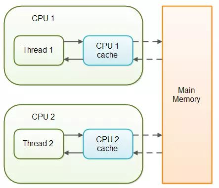
2. JMM8大原子操作
    1. read(读取)：从主存中读取数据
    2. load(载入)：将主存读取到的数据写入工作内存中
    3. use(使用)：从工作内存读取数据做计算
    4. assign(赋值)：将计算好的值重新赋值到工作内存中
    5. store(存储)：将工作内存数据写入主存
    6. write(写入)： 将store过去的变量值赋值给主存中的变量(更新主存)
    7. lock(锁定)：将主存变量加锁，标识为线程独占状态
    8. unlock(解锁)：将主存变量解锁，解锁以后其它线程就可以锁定该变量。
3. 如何保证缓存一致性
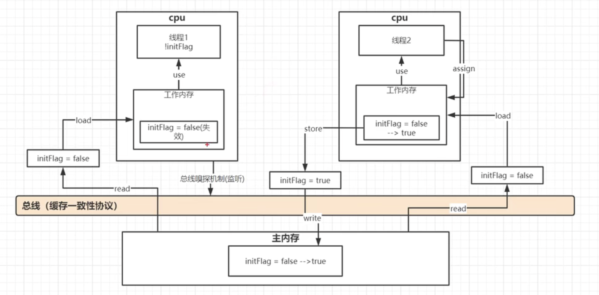
##### Q1:Volatile原理
底层实现主要是通过汇编lock前缀指令,它会锁定这块内存区域中的缓存(并写回到主内存中)
1. 会将当前处理器缓存行的数据**立即**写回到系统内存
1. 这个回写内存操作会引起其他Cpu缓存了该内存地址的数据无效(MESI协议)
1. 提供内存屏障功能;使lock前后指令不能进行重新排序
##### Q2:指令重排和内存屏障
指令序列的重排序：
1）编译器优化的重排序。编译器在不改变单线程程序语义的前提下，可以重新安排语句的执行顺序。
2）指令级并行的重排序。现代处理器采用了指令级并行技术（Instruction-LevelParallelism，ILP）来将多条指令重叠执行。如果不存在数据依赖性，处理器可以改变语句对应机器指令的执行顺序。
3）内存系统的重排序。由于处理器使用缓存和读/写缓冲区，这使得加载和存储操作看上去可能是在乱序执行。
内存屏障:
对于处理器重排序，JMM的处理器重排序规则会要求Java编译器在生成指令序列时，插入特定类型的内存屏障（Memory Barriers，Intel称之为Memory Fence）指令，通过内存屏障指令来禁止特定类型的处理器重排序。通过禁止特定类型的编译器重排序和处理器重排序，为程序员提供一致的内存可见性保证。
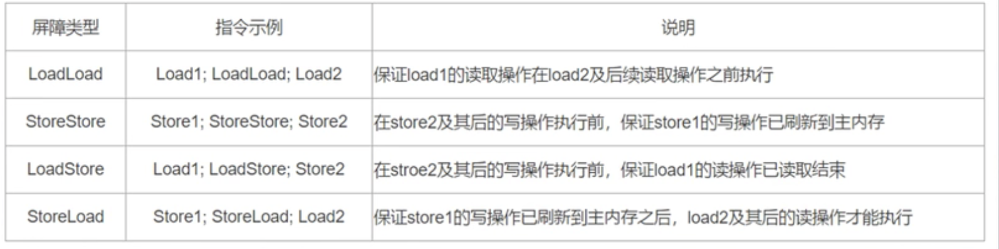
StoreLoad Barriers是一个“全能型”的屏障，它同时具有其他3个屏障的效果。现代的多处理器大多支持该屏障（其他类型的屏障不一定被所有处理器支持）。执行该屏障开销会很昂贵，因为当前处理器通常要把写缓冲区中的数据全部刷新到内存中（Buffer Fully Flush）。
##### Q3:synchronized的三种用法
1. 修饰静态方法;锁定的是当前类的 Class 对象
1. 修饰非静态方法;锁定的是当前实例对象 this
1. 修饰代码块
##### Q4:cas的原理以及可能出现的问题
https://zhuanlan.zhihu.com/p/94762520
1. 原子操作(cpu级别如何保证原子性;总线锁定,缓存锁定)
1. ABA问题(版本号)
1. 自旋的次数增加，过度的消耗 CPU(LongAdder 空间换时间)
##### Q5:synchronized锁升级的过程
https://blog.csdn.net/zzti_erlie/article/details/103997713
JDK1.6之前 synchronized 使用重量级锁
JDK1.6之后 引入了锁的升级
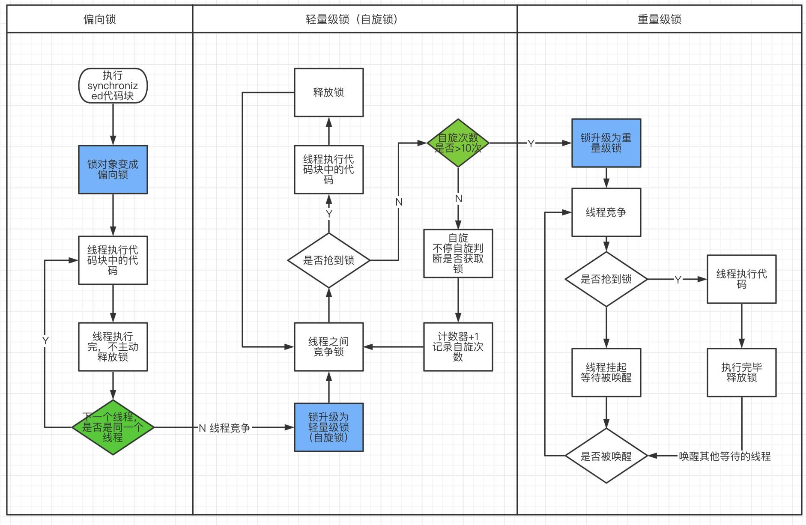
##### Q6:LongAdder分段CAS的优化机制
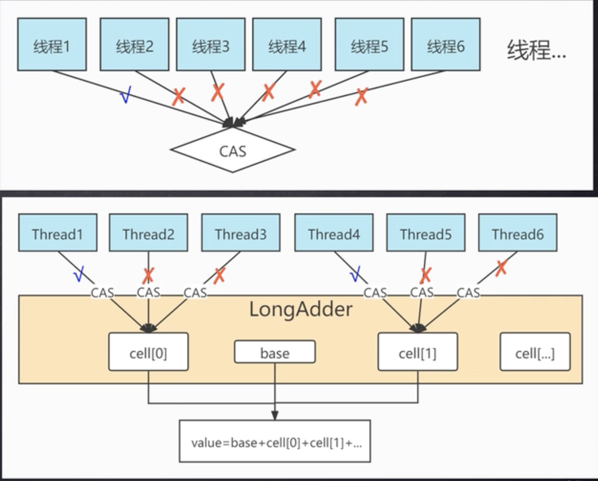
解决cas失败重试cpu消耗高的问题;
LongAdder类与AtomicLong类的区别在于高并发时前者将对单一变量的CAS操作分散为对数组cells中多个元素的CAS操作，取值时进行求和；
而在并发较低时仅对base变量进行CAS操作，与AtomicLong类原理相同。
##### Q7:可重入锁(AQS)
https://zhuanlan.zhihu.com/p/339662001

https://tech.meituan.com/2019/12/05/aqs-theory-and-apply.html

ReentrantLock:可重入锁
AQS:AbstractQueuedSynchronizer(同步队列器)
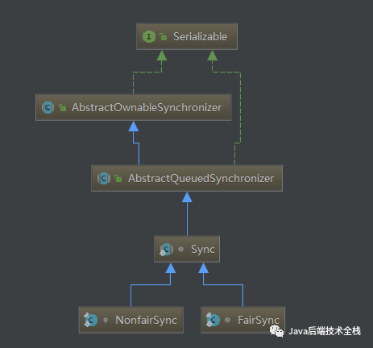
AQS它维护了一个volatile int state（代表共享资源）和一个FIFO线程等待队列（多线程争用资源被阻塞时会进入此队列）。
- 当state=0时，表示无锁状态
- 当state>0时，表示已经有线程获得了锁，也就是state=1。但是因为ReentrantLock允许重入，所以同一个线程多次获得同步锁的时候，state会递增，比如重入5次，那么state=5。而在释放锁的时候，同样需要释放5次直到state=0其他线程才有资格获得锁。
AQS中的队列(CLH队列)，该队列的实现是一个双向链表，被称为sync queue，它表示所有等待锁的线程的集合
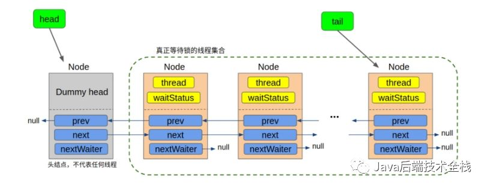
- thread：表示当前Node所代表的线程
- waitStatus：表示节点所处的等待状态，共享锁模式下只需关注三种状态：SIGNALCANCELLED初始态(0)
- prevnext：节点的前驱和后继
- nextWaiter：进作为标记，值永远为null，表示当前处于独占锁模式

AQS两种模式
- 独占模式(ReentrantLock)
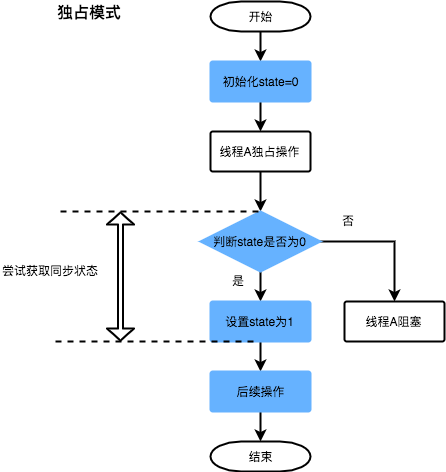
- 共享模式(countDownLatch)
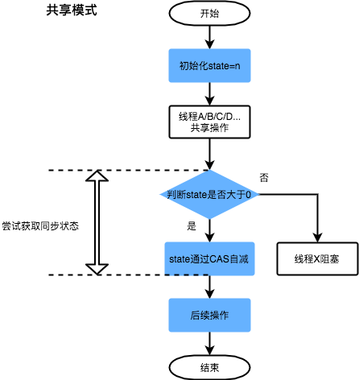
  
AQS公平锁和非公平锁区别：
1. 在lock()方法中，非公平锁一进来就尝试CAS获取锁，不会管等待队列里面是否有等待线程
2. 在tryAcquire方法中，判断state等于0（没有线程持有锁的情况）后，公平锁会先调用hasQueuedPredecessors()方法判断FIFO队列是否有等待线程，没有才继续尝试获取锁，而非公平锁是直接CAS获取锁

##### Q7:ReentrantLock与Synchronized对比
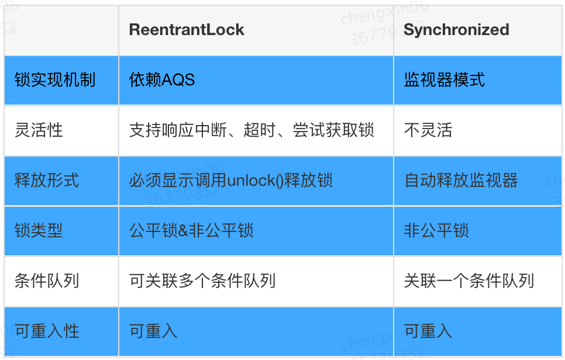
##### Q8:阻塞队列
https://zhuanlan.zhihu.com/p/64156753
##### Q9:伪共享问题

##### Q10:限流
Semaphore(信号量)
高性能限流器Guava RateLimiter
令牌桶算法
##### Q11:无锁并发实现框架Disruptor

#### Q12:CountDownLatch和CyclicBarrier区别
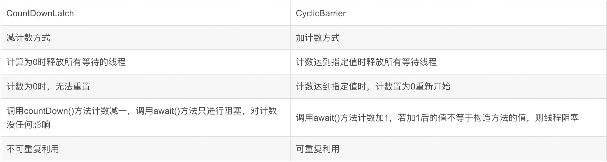
#### Q13:Java线程的生命周期

#### Q14:Executors创建的java自带线程池
线程池:
- newSingleThreadExecutor:
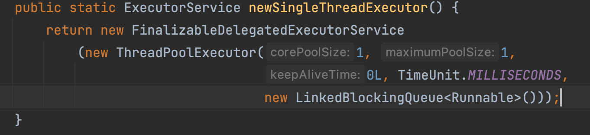
- newFixedThreadPool:
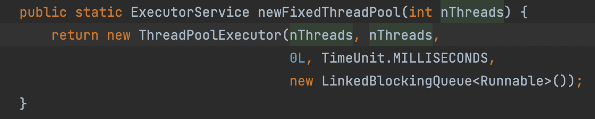
- newCachedThreadPool:
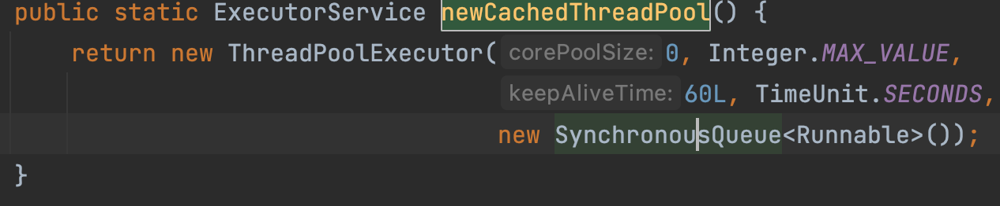
队列:
- SynchronousQueue
SynchronousQueue队列是有界的。Executor会直接提交任务给线程处理，如果没有空闲的线程，则会创建新线程。此时加入队列等待会失败。如果线程数有限制，则会导致无法创建新线程，任务进入异常处理。
- LinkedBlockingQueue
LinkedBlockingQueue无界队列，在线程都处于忙的状态下，将任务加入队列等待。如果请求并发量大，会导致队列不断增长。LinkedBlockingQueue也可以预定义大小。可能造成OOM
- ArrayBlockingQueue
ArrayBlockingQueue有界队列，这种策略主要是防止系统资源被耗尽。在线程池大小受限，队列大小受限的条件下，系统必须考虑异常的场景，所以比较复杂
拒绝策略:
RejectedExecutionHandler策略选择
在任务请求被拒绝以后的处理策略由RejectedExecutionHandler方法决定，一共有如下四种策略：
1.CallerRunsPolicy当任务被拒绝加入等待队列，而又无法新建线程时，任务将由调用Executors的线程执行。
2.AbortPolicy当任务被拒绝处理是，直接抛出RejectedExecutionException
3.DiscardPolicy当任务被拒绝处理，直接被删除不会抛出任何异常
4.DiscardOldestPolicy当任务被拒绝处理，会删掉队列最头部任务，然后重试，如果再次失败，再删掉队列头部数据重试。这种策略会挤掉队列旧任务，比较复杂。
#### Q15:阿里开发手册不推荐使用自带线程池的原因
推荐使用ThreadPoolExecutor方式创建线程池
1. 资源角度;newSingleThreadExecutor,newFixedThreadPool都有可能造成OOM
1. 线程命名;需要对线程以及线程池进行规范的命名;方便排查问题快速定位业务模块
#### Q16:线程池提交任务时execute和submit方法的区别
1、execut()可以添加一个Runable任务,submit()不仅可以添加Runable任务还可以添加Callable任务。
2、execut()没有返回值,而submit()在添加Callable任务时会有返回值(再添加Runable任务时也有,不过无意义),可以通过返回值来查看线程执行的情况。
3、如果发生异常submit()可以通过捕获Future.get抛出的异常,而execute()会终止这个线程。
#### Q17:线程池中的提交优先级与执行优先级
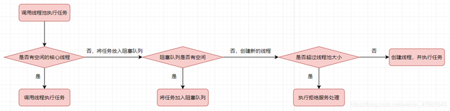
提交优先级
核心线程 > 工作队列 > 非核心线程
执行优先级
核心线程 > 非核心线程 > 工作队列
#### Q18:线程中不可捕获的异常处理
https://www.jianshu.com/p/ad32d98a624f
1. 线程中出现异常
在Thread中，Java提供了一个`setUncaughtExceptionHandler`的方法来设置线程的异常处理函数，你可以把异常处理函数传进去，当发生线程的未捕获异常的时候，由JVM来回调执行。
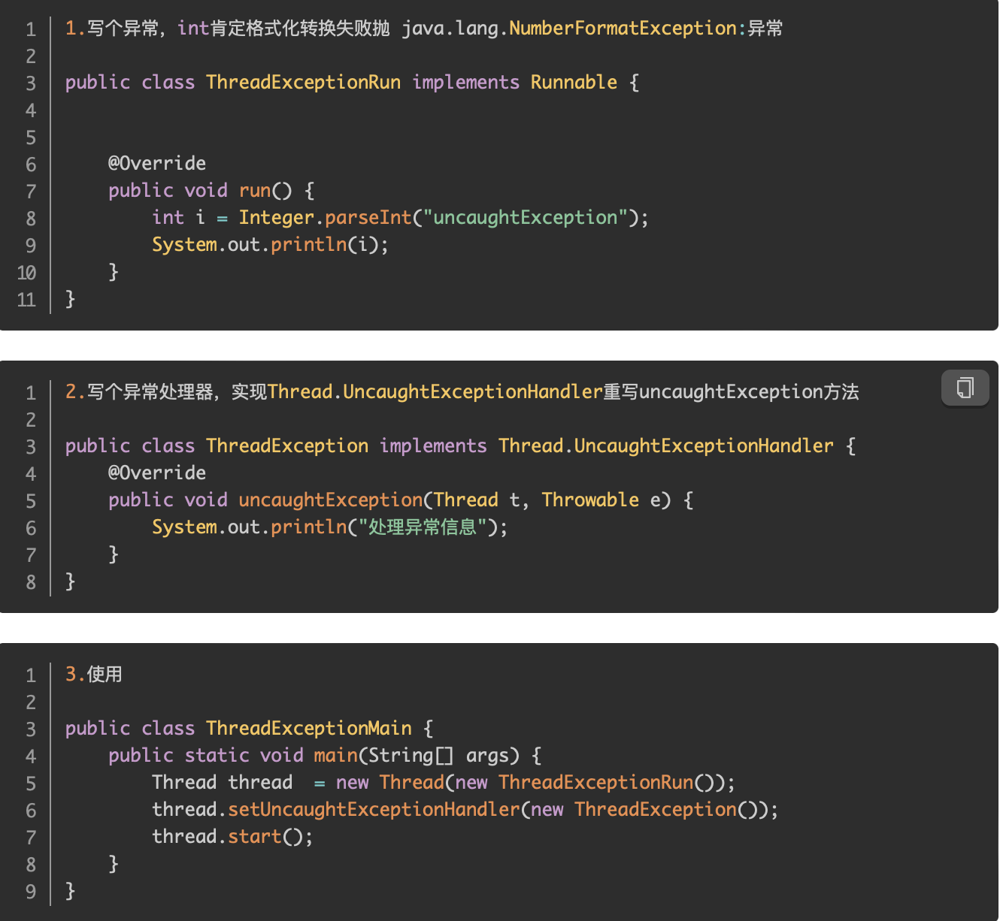
1. 线程池中的异常
- run方法里面try/catch所有处理逻辑
- 重写ThreadPoolExecutor.afterExecute方法
- 使用submit执行任务
使用submit执行任务，该方法将返回一个Future对象，不仅仅是任务的执行结果，异常也会被封装到Future对象中，通过get()方法获取。
#### Q19:线程池的生命周期
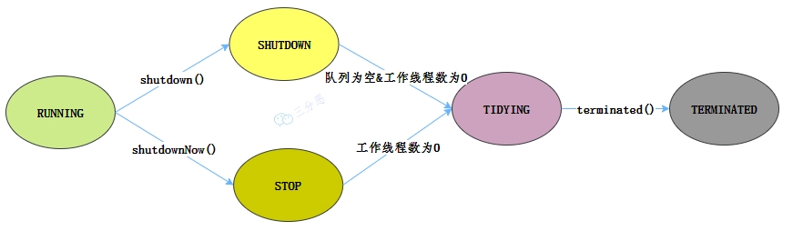
- RUNNING ：能接受新提交的任务，并且也能处理阻塞队列中的任务。
- SHUTDOWN：关闭状态，不再接受新提交的任务，但却可以继续处理阻塞队列中已保存的任务。在线程池处于 RUNNING 状态时，调用 shutdown() 方法会使线程池进入到该状态。（finalize() 方法在执行过程中也会调用 shutdown() 方法进入该状态）。
- STOP：不能接受新任务，也不处理队列中的任务，会中断正在处理任务的线程。在线程池处于 RUNNING 或 SHUTDOWN 状态时，调用 shutdownNow() 方法会使线程池进入到该状态。
- TIDYING：如果所有的任务都已终止了，workerCount (有效线程数) 为0，线程池进入该状态后会调用 terminated() 方法进入 TERMINATED 状态。
- TERMINATED：在 terminated() 方法执行完后进入该状态，默认 terminated() 方法中什么也没有做。
#### Q20 ThreadLocal的原理，实现的数据结构
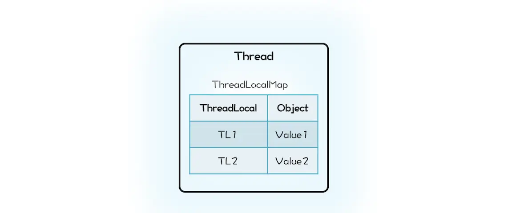
不容易产生内存泄露。在我们的设计方案中，ThreadLocal 持有的 Map 会持有 Thread 对象的引用，这就意味着，只要 ThreadLocal 对象存在，那么 Map 中的 Thread 对象就永远不会被回收。ThreadLocal 的生命周期往往都比线程要长，所以这种设计方案很容易导致内存泄露。而 Java 的实现中 Thread 持有 ThreadLocalMap，而且 ThreadLocalMap 里对 ThreadLocal 的引用还是弱引用（WeakReference），所以只要 Thread 对象可以被回收，那么 ThreadLocalMap 就能被回收。Java 的这种实现方案虽然看上去复杂一些，但是更加安全。
ThreadLocal产生数据泄露的原因:ThreadLocalMap的key为ThreadLocal,为弱引用,此时如果外部没有强引用的情况下发生GC,key将被回收掉,而value未被回收,出现内存泄漏
虽然ThreadLocal在get(),add()方法中都会去清理key不存在的value,但是最好还是由程序手动执行remove方法.
#### Q21 限流算法:令牌桶算法

