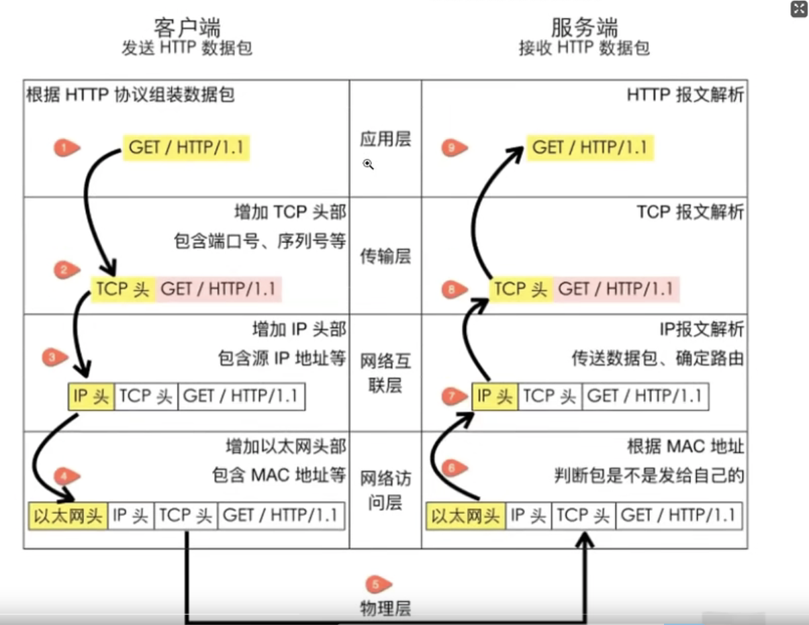
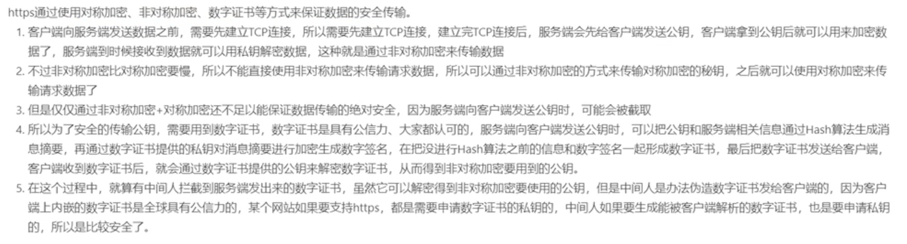
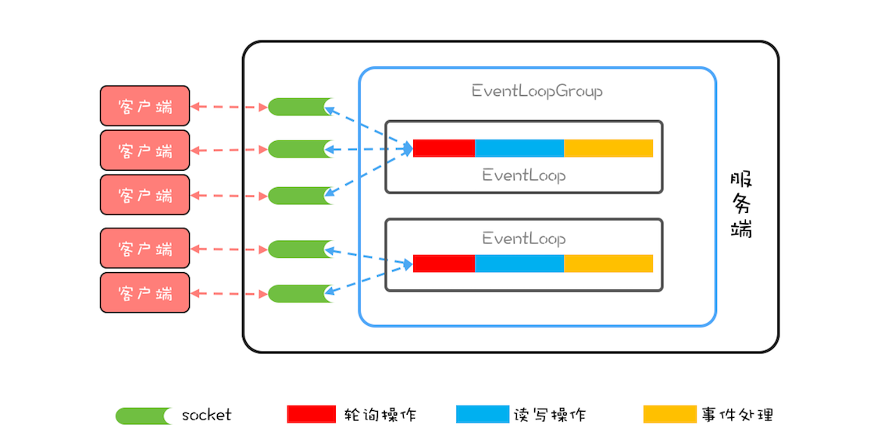
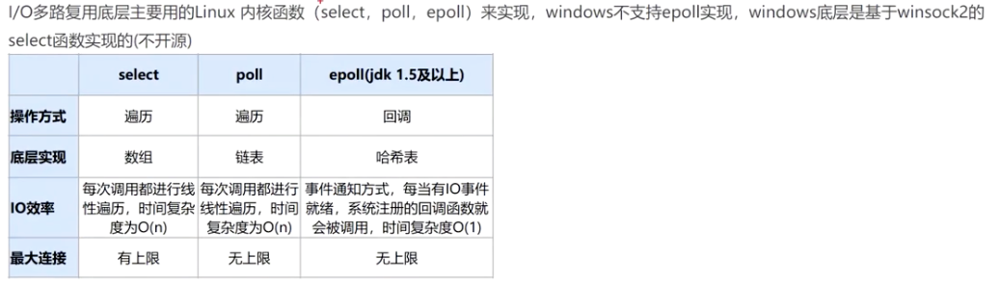
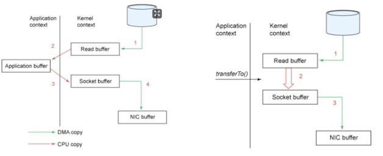

# 网络
#### Q0 TCP、IP;三次握手四次挥手
https://zhuanlan.zhihu.com/p/29724438

TCP 位于传输层，提供可靠的字节流服务。TCP协议为了更容易传送大数据才把数据分割，而且 TCP 协议能够确认数据最终是否送达到对方。 
IP（Internet Protocol）网际协议位于网络层。IP协议的作用是把各种数据包传送给对方。而要保证确实传送到对方那里，则需要满足各类条件。其中两个重要的条件是 IP 地址和 MAC地址（Media Access Control Address）。 
IP 地址指明了节点被分配到的地址，MAC 地址是指网卡所属的固定
#### Q1:TCP协议与UDP协议有什么区别
TCP : 传输控制协议是基于连接的协议，在正式收发数据前，必须和对方建立可靠的连接。速度慢，合适传输大量数据。 
UDP（User Data Protocol，用户数据报协议） : 用户数据报协议是与TCP相对应的协议。面向非连接的协议，不与对方建立连接，而是直接就把数据包发送过去，速度快，适合传输少量数据。
#### Q1 什么是跨域请求?有什么问题?
https://www.jianshu.com/p/f880878c1398
跨域请求概述:当前发起请求的域与该请求指向的资源所在的域不一样。这里的域指的是这样的一个概念：我们认为若协议 + 域名 + 端口号均相同，那么就是同域。 
跨域请求带来的安全问题: 
CSRF攻击(Cross-site request forgery):中文名称：跨站请求伪造，也被称为：one click attack/session riding，缩写为：CSRF/XSRF。CSRF攻击者在用户已经登录目标网站之后，诱使用户访问一个攻击页面，利用目标网站对用户的信任，以用户身份在攻击页面对目标网站发起伪造用户操作的请求，达到攻击目的。 

如果想要绕过跨域的限制也是可以的:
1. reponse添加header,设置`Access-Control-Allow-Methods：*`;表示可以访问所有网站,不受是否同源的限制
1. jsonp的方式,该技术底层就是基于script标签来实现的,因为script标签是可以跨域的
1. 后台自己控制,先访问同域名下的接口,然后在接口中再去使用HTTPClinet等工具去调用目标接口.
1. 网关,和第三种方式类似,都是交给后台服务来进行跨域访问.
#### Q2 HTTPS是如何保证安全传输的
https://zhuanlan.zhihu.com/p/365641340

非对称加密:公钥加密,私钥解密

电子签名:私钥加签,公钥验签

数字证书:证书认证中心 CA。当服务端要把公钥发送给客户端时，不是直接发送公钥，而是先把公钥发送给 CA，CA 根据公钥生成一份「证书」给到服务端，服务端将证书给客户端。客户端拿到证书后去 CA 验证证书的合法性，确保证书是服务端下发的。
#### Q3 HTTPS与HTTP的区别
https://zhuanlan.zhihu.com/p/72616216
HTTP:是互联网上应用最为广泛的一种网络通信协议,基于TCP,可以使浏览器工作更为高效,减少网络传输

HTTPS:是HTTP的加强版,可以认为是HTTP+SSL(Secure Socket Layser).在HTTP的基础上增加了一系列的安全机制.

一方面保证数据传输安全,另一方面对访问者增加了验证机制.是目前现行架构下,最为安全的解决办法.

主要区别:
1. HTTP的连接是简单无状态的,HTTPS的数据传输是经过证书加密的,安全性更高
1. HTTP是免费的,而HTTPS需要申请证书,而证书通常是需要收费的,并且费用一般不低.
1. 它们的传输协议不通,所以使用的端口也是不一样的,HTTP默认是80端口,HTTPS默认是443端口.
   HTTPS的缺点:
1. HTTPS的握手协议比较费时,所以会影响服务的响应速度以及吞吐量.
1. HTTPS也并不是完全安全的.他的证书体系其实并不是完全安全的.并且在面对DDOS这样的攻击时,几乎起不到任何作用.
1. 证书需要费钱,并且功能越强大的证书费用越高.
#### Q4 Netty
1. Netty的线程模型
   https://zhuanlan.zhihu.com/p/87630368
   
   Netty 中还有一个核心概念是 EventLoopGroup，顾名思义，一个 EventLoopGroup 由一组 EventLoop 组成。实际使用中，一般都会创建两个 EventLoopGroup，一个称为 bossGroup，一个称为 workerGroup。
   
   在 Netty 中，bossGroup 就用来处理连接请求的，而 workerGroup 是用来处理读写请求的。bossGroup 处理完连接请求后，会将这个连接提交给 workerGroup 来处理， workerGroup 里面有多个 EventLoop，那新的连接会交给哪个 EventLoop 来处理呢？这就需要一个负载均衡算法，Netty 中目前使用的是轮询算法。
1. 高性能的表现
    - NIO模型,用最少的资源做更多的事情
    - 内存零拷贝,尽量减少不必要的内存拷贝,实现了更高效率的传输
    - 内存池设计,申请的内存可以重用,主要指直接内存.内存实现是用一颗二叉查找树管理内存的分配情况
    - 串行化处理读写
    - 高性能序列化协议,支持protobuf等高性能序列化协议‘
    - 高效并发编程的体现:volatile的大量使用、争取使用;CAS和原子类的广泛使用;线程安全容器的使用;通过读写锁提升兵法性能
1. select,poll,epoll模型的区别
   
   select 最大监听1024个fd 
   epoll_create:创建epoll句柄`int epfd = epoll_create(intsize);`创建一个epoll的句柄，size用来告诉内核这个监听的数目一共有多大。 
   epoll_ctl:被监听的描述符添加到epoll句柄或从epool句柄中删除或者对监听事件进行修改。`int epoll_ctl(int epfd, int op, int fd, struct epoll_event *event)`用于控制某个epoll文件描述符上的事件，可以注册事件，修改事件，删除事件。 
   epoll_wait:等待事件触发，当超过timeout还没有事件触发时，就超时。
#### Q5 RPC与HTTP的区别;什么是GRPC
HTTP和RPC不是对等的概念。

RPC是一个完整的远程调用方案，它包括了：接口规范+序列化反序列化规范+通信协议等。

HTTP只是一个通信协议，工作在OSI的第七层，不是一个完整的远程调用方案。

GRPC:是谷歌开源的一个 RPC 框架，面向移动和 HTTP/2 设计。
- 内容交换格式采用ProtoBuf(Google Protocol Buffers)，开源已久，提供了一种灵活、高效、自动序列化结构数据的机制，作用与XML，Json类似，但使用二进制，（反）序列化速度快，压缩效率高。
- 传输协议 采用http2，性能比http1.1好了很多
#### Q6 cookie与Session的区别
https://www.jianshu.com/p/2f7031a69f43
#### Q7 什么是零拷贝
零拷贝指的是,应用程序需要把内核中的一块区域转移到另外一块内核区域中去,不需要经过先复制到
用户空间,在转移到目标内核区域去了,从而实现直接转移.
